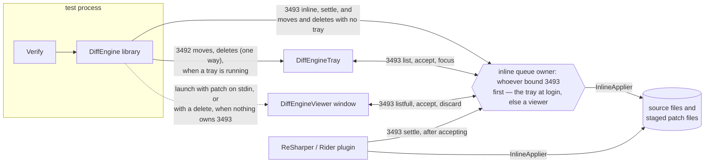

# CLAUDE.md

This file provides guidance to Claude Code (claude.ai/code) when working with code in this repository.

## Solution

`src/DiffEngine.slnx`

## Build and Test Commands

```bash
# Build (from repo root). Also packs: ProjectDefaults sets GeneratePackageOnBuild in Release.
dotnet build src --configuration Release

# Run all tests
dotnet test --project src/DiffEngine.Tests --configuration Release
dotnet test --project src/DiffEngineTray.Tests --configuration Release
dotnet test --project src/DiffEngineViewer.Tests --configuration Release

# Run a single test project with filter
dotnet test --project src/DiffEngine.Tests --configuration Release --filter "FullyQualifiedName~ClassName"

# Run a specific test
dotnet test --project src/DiffEngine.Tests --configuration Release --filter "FullyQualifiedName=DiffEngine.Tests.ClassName.TestMethod"
```

**SDK Requirements:** .NET 10 SDK (see `src/global.json`). The project uses preview/prerelease SDK features.

**Target Frameworks:**
- DiffEngine library: net462, net472, net48, net6.0, net7.0, net8.0, net9.0, net10.0 (Windows also includes .NET Framework targets)
- DiffEngineTray: net10.0 Windows Forms application
- Tests: net10.0 (net48 on Windows)

## Architecture Overview

DiffEngine is a library that manages launching and cleanup of diff tools for snapshot/approval testing. It's used by ApprovalTests, Shouldly, and Verify.

### The ecosystem

Five parties, three transports. The library runs inside the test process (embedded in Verify and
the others); the tray and viewer are separate processes; the ReSharper/Rider plugin
([jetbrains-plugin-verify](https://github.com/VerifyTests/jetbrains-plugin-verify)) embeds the
library inside the IDE. `docs/inline.md` is the durable, consumer-facing version of this map.



The failing-inline-snapshot flow: Verify builds an `InlinePatch` and calls
`DiffRunner.AddInlineAsync`. If something owns 3493 the patch goes over the socket and the owner
shows or focuses a window; if nothing does, the bundled viewer is launched with the patch on
stdin and binds the port itself; if no viewer resolves (or `DiffEngine_InlineViewer=false`),
Verify stages `received`/`expected`/`.inlinepatch` files and the IDE plugin or a text diff tool
becomes the review surface. Accepting anywhere runs `InlineApplier` against the source file
(per-file cross-process mutex — safe concurrently from any process). A passing re-run calls
`SettleInline`, and any surface that applies a patch itself must settle too, or the queue owner
keeps offering a snapshot that is already in the source.

The source may be C# or F#, decided by the file's extension (`SourceLanguage.ForFile`) rather than
stated on the patch. `InlinePatcher` walks the same structure either way — a name, an argument
list, a chain hung off it — and everything per language sits on `SourceLanguage`: the lexing that
fills a `SourceScan`, what tells a declaration from a call, and how a literal is written and read
back. F# is the awkward one, because it has no raw string: triple-quoted content is verbatim, so a
multi-line snapshot is written at the left margin, and its last line then decides the column of
everything after the literal. Where that would land left of the statement, F#'s offside rule stops
the file compiling, so the render switches to backslash continuations instead — a line of snapshot
per line of source, all of it indented, at the cost of escaping. That rule is asserted
by compiling patched source with `dotnet fsi` (`FsCompilerRoundTripTests`), because a belief about
F#'s lexis is exactly the kind of thing a second copy of the same belief cannot check.

A patch is anchored to the call by `OriginalExpression`, the argument's source text from
`CallerArgumentExpression`, so a file that moved since the run still patches the right call. F#
does not implement that attribute (FS0202), so a producer sends `OriginalValue` — the argument's
value — and the patcher matches on what a literal parses to instead of on what it says. Same
anchor, one parse apart. With neither, the hint is all there is and a differing literal is taken
as the snapshot that changed, or a snapshot could be accepted once and never updated.
`MemberName` (`CallerMemberName`, which F# does implement) narrows on top of either: a call above
that member's declaration is not in it, so an identical snapshot in the test next door is not a
candidate at all, while the recorded line is still tried first so two snapshots in one member stay
apart.

### Core Components

**DiffEngine Library (`src/DiffEngine/`):**
- `DiffRunner` - Main entry point. Launches diff tools via `Launch`/`LaunchAsync` methods and kills them via `Kill`. Handles process lifecycle.
- `DiffTools` - Registry of available diff tools. Maintains lookups by extension and path. Initialized from `Definitions` and ordered by `OrderReader`.
- `Definitions` - Static collection of all supported diff tool definitions. Each tool is defined in `Implementation/` folder.
- `Definition` - Record type describing a diff tool: executable paths, command arguments, supported extensions, OS support, MDI behavior, auto-refresh capability.
- `DiffTool` - Enum of all supported diff tools (BeyondCompare, P4Merge, VS Code, etc.)
- `ResolvedTool` - A diff tool that was found on the system with its resolved executable path.
- `BuildServerDetector` - Detects CI/build server environments to disable diff tool launching.

**DiffEngineViewer (`src/DiffEngineViewer/` plus three heads):**
- Cross platform GUI diff tool. Reviews inline snapshots and plain two-file diffs.
- `src/DiffEngineViewer/` is a **library** (`DiffEngineViewer.Core.dll`) holding everything that is
  not a renderer. `src/DiffEngineViewer.{Windows,Mac,Linux}/` are thin `Exe` heads, one package
  each, all named `DiffEngineViewer` so the launcher can resolve the executable by name.
- One package per OS rather than one portable one, because WinForms must be named as a framework
  dependency and such a package cannot start on macOS or Linux.
- Bundled inside DiffEngine.nupkg under `tools/viewer/{rid}/`, so inline snapshots work with no
  extra install. `DiffEngine.csproj` maps each RID to the head that renders on it.
- `ViewerSession` is a pure state machine over an immutable `SessionState`. `ScreenBuilder`
  projects that into a `Screen` (already sliced to the visible rows), which `AsciiRenderer` draws
  as text and each `IViewerWindow` draws as pixels. Every renderer consumes the identical
  structure, which is what makes the text snapshots meaningful and keeps three renderers honest.
- `ViewerProgram.Run(args, OpenWindow)` owns the loop for all heads. A head is a `Main` that
  chooses a renderer; nothing else about the app is per platform.
- Windows renders with **WinForms** and loads no native library. It is pumped through
  `Application.DoEvents` rather than `Application.Run`, so the shared loop stays shared. Only the
  grid is owner drawn: the footer, the context menu, the pane scrollbar and the tooltips are real
  controls, so they get the OS's keyboard handling, theming and screen reader support. The menu is
  still projected from the same `Screen.Menu` the other heads draw.
- macOS renders with **AppKit and Core Text** (`native/swift/`), Linux with **raylib and Dear
  ImGui** (`native/`). Both implement the same C ABI, so the managed interop layer is identical.
- macOS took the same treatment as Windows: a real menu bar, an `NSMenu` context menu, `NSView`
  tooltips and an `NSScroller`, with `NSApp.appearance` set to `darkAqua` so they match the drawn
  grid. The cost is that none of them exists in `deview_capture`, which makes no window — hence
  `PixelTests.ContextMenu` being skipped there, and the scroller taking its strip out of the
  renderer only when a window exists.
- Linux draws its own menu, so it keeps that baseline. Its tooltip and pane scrollbar are ImGui's,
  the scrollbar being `ScrollbarEx` driven in rows rather than pixels so its travel is exactly
  `ViewerSession`'s clamp.
- Group headers fold. `SessionState.Collapsed` holds `QueueItem.GroupKey`s and `QueueProjection`
  skips their members, so the marker rides in the label and no head or ABI field knows about it.
  Whether an entry is hidden is always read back out of `VisibleEntries`, never recomputed — the
  rules about when a header exists at all live in one place and must stay there. A fold is a view:
  `AcceptAll` still sweeps what it hides, which `CollapseTests` pins.
- Images (`Images/`, extensions in `DiffEngine/Viewer/ImageExtensions.cs`, linked into the viewer so
  the tool registration and the renderer cannot disagree) are a side, not a mode. `FileSide.Read`
  decides text or picture **by extension**, because the expected side of a new snapshot has no bytes
  to sniff, and `ImageRows` produces the same aligned `Row` lists `DiffRows` does — one per property,
  coloured against the other side. So every head compares images today with no ABI change. Whether
  the two are the same file belongs to the pair rather than to a side, so it is the status line.
  `Pane.Image` is an **enrichment**: all three heads paint the picture under those rows, each with
  its toolkit's own decoder (GDI+, ImageIO, raylib), so *which formats draw* is per platform while
  *what the comparison says* is not. Nothing about a comparison may become expressible only through
  the picture, or the text snapshots stop describing what a head without that decoder shows. All
  three fit from `ImagePane.Width/Height` — the file header's numbers, not the decoder's — one blank
  line under the pane's rows, so the placement rule lives once. Headers are sniffed by hand
  (`ImageHeader`) rather than by System.Drawing, which does not exist on macOS or Linux.
- Queue tooltips are composed once in `QueueProjection`, not per head, and are **null when they
  would only repeat the row**. Labels are already the shortest distinguishing form, so the tip is
  what the label left off — path, test, frameworks, failure text. `QueueTooltipTests` snapshots the
  rule; the heads only display the string.
- Does **not** reference DiffEngine. It links `Inline/*.cs`, `Protocol/*.cs` and
  `Tray/TrayDetector.cs` as source, because DiffEngine publishes and embeds the heads and a
  reference back would be a cycle.
- Holds pending moves and deletes itself when it owns the queue, which is what happens with no
  tray installed. They are ordinary `QueueEntryKind.Move`/`Delete` entries — the same ones an
  attached viewer draws for the tray's — so nothing about how they look or what their menu offers
  is per arrangement. Only who applies them differs: `ViewerActions.MoveFile`/`DeleteFile` here,
  a forwarded key there.
- Single instance by socket bind on 3493 (`DiffEngine_ViewerPort`): whoever binds owns the queue,
  and a process that fails to bind talks to the owner instead. A viewer that does not own one runs
  with `--attach`: it polls `listfull`, derives every pane from the patches that come back, and
  forwards accept and discard rather than applying them.

**The viewer protocol (`src/DiffEngine/Protocol/`):**
- `ViewerVerb`, `ViewerMessage`, `ViewerResponse`, `ViewerPayload`, `ViewerClient`, `ViewerServer`.
- Lives in DiffEngine because all three processes speak it, and any of them can be the owner. It
  was previously written twice, once per side, with tests holding the halves together; one
  implementation removes the failure mode instead of detecting it.
- Plain text, every value base64, for the same reason `InlinePatchFile` is: snapshot text contains
  quotes, braces and newlines, and the `inline` body carries an `InlinePatchFile` payload verbatim.
- Compiles for every DiffEngine target, so the socket calls carry `#if` branches for the
  frameworks with no cancellation overloads. `ViewerProtocolTests` runs on all of them.

**Native shim (`native/`), used by the Mac and Linux heads only:**
- `raylib` and `imgui` are fetched by CMake (`FetchContent`), pinned by tag in
  `native/CMakeLists.txt`. Deliberately not submodules: nothing in a normal `dotnet build` touches
  this folder, so a recursive clone on every checkout would serve a path almost nobody takes.
- Building it needs CMake 3.24+, a C++17 compiler and network access. Contributors do not need
  any of that, because the binaries are committed.
- `native/src/deview.cpp` is a renderer for the `Screen` model, not an ImGui binding: eight exports
  taking one flat blittable frame description. The ABI is `native/include/deview.h`; bump
  `DEVIEW_VERSION` whenever the structs change **or a field changes meaning**. The managed side
  refuses a library whose version is not an exact match, so a bump and a binaries rebuild land
  together: change `native/`, run `build-native`, merge the PR it opens. Between the two, the
  `native` CI job — the one that loads the committed binaries — reports the mismatch, which is the
  check working.
- Built binaries are **committed** to `src/DiffEngineViewer.{Linux,Mac}/runtimes/{rid}/native/`, so a plain
  `dotnet build` produces a shippable package and contributors never need CMake. Regenerate them
  with the `build-native` GitHub workflow, which opens a PR.

**DiffEngineTray (`src/DiffEngineTray/`):**
- Windows Forms tray application that handles pending file diffs
- `PiperServer` - TCP server (localhost, 3492) receiving move/delete payloads from DiffEngine.
  Deliberately a second listener beside the viewer protocol, not debt: its format is frozen
  (every stable DiffEngine embeds PiperClient, pinned in test projects while the tray updates
  independently), and the ports answer different questions — 3492 "a tray is here", 3493 "the
  queue owner is here", which is sometimes a viewer. Merging them breaks the late-starting-tray
  case. Full rationale on the PiperServer class doc.
- `Tracker` - Manages pending file moves and deletes with concurrent dictionaries
- `OwnedInlineHost` / `RemoteInlineHost` - The tray binds 3493 at startup and holds the inline
  queue when it wins, which it usually does because it starts at login. A viewer that got there
  first keeps the queue for as long as it runs, and the tray drives it remotely instead. Decided
  once, never transferred, so handover is not something that has to work.
- Either host runs the same `InlineQueue` from DiffEngine, so the two cannot differ on what
  accepting or settling means. Owning it means accepting runs on a listener thread rather than on
  a render loop, which is where `InlineApplier`'s ten second mutex wait used to sit.
- Which arrangement is live decides *which process applies an accept*, so both are pinned by
  `TrayViewerSyncTest` — a real tray and a real `SessionState` over a real socket, asserting that
  an accept, discard, sweep or settle from either surface leaves the other showing the same thing.
  It sits in DiffEngineTray.Tests because that is the only project that can reference both halves
  (the viewer aliased, since it links DiffEngine's sources and so declares the same type names).
  The wire carries `ok` and a message, not an apply status, so `RemoteInlineHost` decides applied
  versus failed by re-reading the listing: an owner keeps a failed entry pending, and taking `ok`
  at face value used to report it as accepted while the viewer was still showing it.
- A viewer that owns the queue answers about the tray's snapshots and about its **own** pending
  files. Moves and deletes go to the tray when one is running and to the queue owner when one is
  not (`PendingFiles`), because the alternative was that with no tray they went nowhere at all —
  the send was skipped and the file was pending in nothing. A tray that owns the queue answers
  those verbs too, routing them into the same tracked files the piper port fills, which is
  load bearing rather than defensive: `DiffEngineTray.IsRunning` is cached at type init, so a test
  process that started before the tray addresses the queue owner for the rest of its life.
- A delete starts a viewer when nothing owns the queue; a move does not. A move already has a
  window — the diff tool DiffRunner just launched for that pair — and a delete has no second file
  to compare against, so no tool ever opens for it. `--delete <file>` is the launch, on the command
  line rather than stdin because a path fits where snapshot content does not.
- The catch that shape creates: every inline transition rebuilds its half of the queue from
  `InlineQueue`, so `ViewerSession.Rebuild` carries the tracked entries across it. Without that,
  accepting one snapshot silently drops the files pending beside it. `Sync` is the one caller that
  must not, since it is replacing them with what the owner just reported.
- `DebugReport` / `DebugForm` - the menu's "Debug view": every field of every tracked move, delete
  and snapshot as text, plus the queued patches when this tray owns the queue. The report is a
  string so it can be copied into an issue and snapshot tested without rendering a window.
- Allows accepting/discarding diffs from system tray

**Packaging.Tests (`src/Packaging.Tests/`):**
- Opens each `.nupkg` a Release build drops in `nugets` and snapshots its entry list, plus a few
  invariants a snapshot states poorly: an apphost with no assembly beside it, a viewer file in the
  tray package, an incomplete bundled head.
- Exists because package content is assembled by several unrelated MSBuild mechanisms and nothing
  else asserts the result. The failure mode it was written for is stale build output: `PackAsTool`
  packages the publish directory wholesale, and MSBuild never removes a file that stopped being
  produced, so anything a discarded experiment left in `bin` keeps shipping.
- Windows only, and skipped entirely when no packages were produced, which is every Debug build.

### Adding a New Diff Tool

1. Add enum value to `DiffTool.cs`
2. Create implementation in `src/DiffEngine/Implementation/` following existing patterns (see `BeyondCompare.cs`)
3. Register in `Definitions.cs` collection
4. The `Definition` record specifies:
   - Executable name and search paths per OS (`OsSupport`)
   - Argument builders for temp/target file positioning
   - Binary file extensions supported
   - Whether tool supports auto-refresh, is MDI, requires target file to exist

### Key Patterns

- Tool discovery uses wildcard path matching (`WildcardFileFinder`) to find executables in common install locations
- Tool order can be customized via `DiffEngine_ToolOrder` environment variable
- `DisabledChecker` respects `DiffEngine_Disabled` env var
- Tests use TUnit and Verify for snapshot testing
