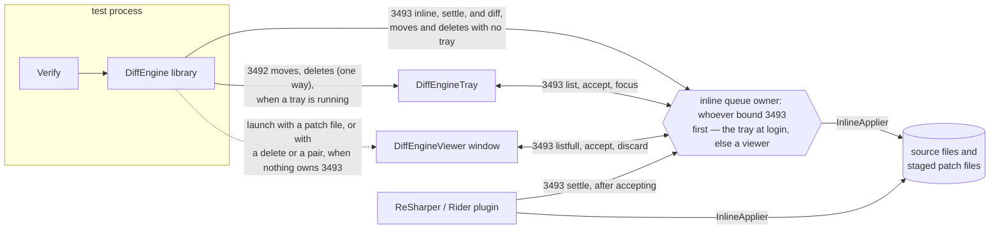

# CLAUDE.md

This file provides guidance to Claude Code (claude.ai/code) when working with code in this repository.

## Solution

`src/DiffEngine.slnx`

## Build and Test Commands

```bash
# Build (from repo root). Also packs: ProjectDefaults sets GeneratePackageOnBuild in Release.
dotnet build src --configuration Release

# Run all tests, which is what CI runs
dotnet test --solution src/DiffEngine.slnx --configuration Release --no-build --no-restore

# Run one test project
dotnet test --project src/DiffEngine.Tests/DiffEngine.Tests.csproj --configuration Release --no-build --no-restore

# Run one class, then one test
dotnet test --project src/DiffEngine.Tests/DiffEngine.Tests.csproj --configuration Release --no-build --no-restore -- --treenode-filter "/*/*/ClassName/*"
dotnet test --project src/DiffEngine.Tests/DiffEngine.Tests.csproj --configuration Release --no-build --no-restore -- --treenode-filter "/*/*/ClassName/MethodName"

# Or run the test project directly, which is the fastest loop and takes the same filter
src/DiffEngine.Tests/bin/Debug/net10.0/DiffEngine.Tests.exe --treenode-filter "/*/*/ClassName/*"

# Benchmarks, one project per assembly they reach into. --filter takes class or method globs
dotnet run -c Release --project src/DiffEngine.Benchmarks -- --filter "*TextDiff*"
dotnet run -c Release --project src/DiffEngineViewer.Benchmarks -- --filter "*Frame*"
dotnet run -c Release --project src/DiffEngineViewer.Windows.Benchmarks -- --filter "*"
```

**Benchmarks:** BenchmarkDotNet, run in process with a short job, both set in each project's `Program.cs`. Its default toolchain generates a project under `bin/` and builds it with one `OutDir` for everything it references; DiffEngine references the three viewer heads for build ordering, all three are named `DiffEngineViewer`, and they overwrite one another there, so the default cannot build. Three projects because of what each has to see inside: the library, the viewer's core (which links the library's sources, so one project referencing both finds every shared type ambiguous), and the WinForms head (which only builds for Windows). Each is signed and named in `InternalsVisibleTo`. A benchmark measures the product's own code path, and where a fix replaces a path rather than adding one, the benchmark is committed before the fix so the earlier number can be had again from history. Three iterations settle a cost that is out by multiples and not one that is out by a tenth: pass `--iterationCount` for that. The viewer project's `Native` classes turn the Linux head's real window, so they are left out of a run wherever there is no shim or no display, which is every run on Windows: they run in the `ubuntu:24.04` container the pixel snapshots reproduce in, under `xvfb-run`, by the command in `NativeFrameBenchmarks`' summary. The clock says little there, since the shim holds a turn to a sixtieth of a second, so they report processor time, the X server's, and what OpenGL counted as drawn.

**Test runner:** TUnit runs on Microsoft.Testing.Platform rather than VSTest, which changes two things about the commands above. Filters are treenode paths given after `--`, as `/Assembly/Namespace/Class/Test` with `*` for any segment; VSTest's `--filter "FullyQualifiedName~ClassName"` matches nothing and exits 5, so a filtered run that reports no failures may have run no tests. And `--nologo` makes any run report "Zero tests ran" and exit 5, whatever else is on the command line, so leave it off.

**SDK Requirements:** .NET 10 SDK (see `global.json`, at the repository root rather than under `src`). It also carries `"test": { "runner": "Microsoft.Testing.Platform" }`, which is what puts `dotnet test` on the runner described above. The project uses preview/prerelease SDK features.

**Target Frameworks:**
- DiffEngine library: net462, net472, net48, net6.0, net7.0, net8.0, net9.0, net10.0 (Windows also includes .NET Framework targets)
- DiffEngineTray: net10.0 Windows Forms application
- Tests: net10.0 (net48 on Windows)

## Architecture Overview

DiffEngine is a library that manages launching and cleanup of diff tools for snapshot/approval testing. It's used by ApprovalTests, Shouldly, and Verify.

### The ecosystem

Five parties, three transports. The library runs inside the test process (embedded in Verify and
the others); the tray and viewer are separate processes; the ReSharper/Rider plugin
([jetbrains-plugin-verify](https://github.com/VerifyTests/jetbrains-plugin-verify)) embeds the
library inside the IDE. `docs/inline.md` is the durable, consumer-facing version of this map.


```mermaid
flowchart LR
    subgraph Test["test process"]
        Verify["Verify"] --> Engine["DiffEngine library"]
    end
    Tray["DiffEngineTray"]
    Window["DiffEngineViewer window"]
    Plugin["ReSharper / Rider plugin"]
    Owner{{"inline queue owner: whoever bound 3493<br/>first — the tray at login, else a viewer"}}
    Files[("source files and<br/>staged patch files")]

    Engine -->|"3492 moves, deletes (one way),<br/>when a tray is running"| Tray
    Engine -->|"3493 inline, settle, and diff,<br/>moves and deletes with no tray"| Owner
    Engine -.->|"launch with a patch file, or with<br/>a delete or a pair, when nothing owns 3493"| Window
    Tray <-->|"3493 list, accept, focus"| Owner
    Window <-->|"3493 listfull, accept, discard"| Owner
    Plugin -->|"3493 settle, after accepting"| Owner
    Owner -->|"InlineApplier"| Files
    Plugin -->|"InlineApplier"| Files
```

The failing-inline-snapshot flow: Verify builds an `InlinePatch` and calls
`DiffRunner.AddInlineAsync`. If something owns 3493 the patch goes over the socket and the owner
shows or focuses a window; if nothing does, the bundled viewer is launched with the patch in
a temp file (`--payload`, which the viewer deletes) and binds the port itself; if no viewer resolves (or `DiffEngine_InlineViewer=false`),
Verify stages `received`/`expected`/`.inlinepatch` files and the IDE plugin or a text diff tool
becomes the review surface. Accepting anywhere runs `InlineApplier` against the source file
(per-file cross-process mutex — safe concurrently from any process). A passing re-run calls
`SettleInline`, and any surface that applies a patch itself must call `SettleAppliedInline` — not
`SettleInline`, whose framework label is the running process's own and so never matches an entry
some other process queued, missing silently — or the queue owner keeps offering a snapshot that is
already in the source.

The source may be C# or F#, decided by the file's extension (`SourceLanguage.ForFile`) rather than
stated on the patch. `InlinePatcher` walks the same structure either way — a name, an argument
list, a chain hung off it — and everything per language sits on `SourceLanguage`: the lexing that
fills a `SourceScan`, what tells a declaration from a call, and how a literal is written and read
back. F# is the awkward one, because it has no raw string: its compiler hands over a triple-quoted
literal verbatim, line break after the opening delimiter and every line's indentation included. So
the same shape C# writes is written for F# too and the trimming is a convention -
`SourceLanguage.SnapshotValue` is the reader's half, and a test library that skips it fails every
F# snapshot against itself. Writing content at the left margin instead was tried and abandoned:
F#'s offside rule then rejects anything ending in a newline. The agreement is asserted by compiling
patched source with `dotnet fsi` and applying the trim there in F# (`FsCompilerRoundTripTests`),
because a belief about F#'s lexis is exactly the kind of thing a second copy of the same belief
cannot check. With both languages on the same shapes, the rendering and most of the parsing is one
implementation in `StringLiteral`; what is left per language is delimiter widening, which F# lacks
(FS1232), and the escapes a regular literal carries.

A patch is anchored to the call by `OriginalExpression`, the argument's source text from
`CallerArgumentExpression`, so a file that moved since the run still patches the right call. F#
does not implement that attribute (FS0202), so a producer sends `OriginalValue` — the argument's
value — and the patcher matches on what a literal parses to instead of on what it says. Same
anchor, one parse apart. With neither, the hint is all there is and a differing literal is taken
as the snapshot that changed, or a snapshot could be accepted once and never updated.
`MemberName` (`CallerMemberName`, which F# does implement) narrows on top of either: a call above
that member's declaration is not in it, so an identical snapshot in the test next door is not a
candidate at all, while the recorded line is still tried first so two snapshots in one member stay
apart.

A line names a call site only until something above it in the file changes, and accepting a
snapshot is exactly that. So whoever finds a queued entry by its line asks whose it is before
believing it. A settle that hits an entry queued from another member leaves it alone unless the
value settles it, and a failing re-run whose key names nothing looks for the entry of its own
call site (`InlinePatch.IsSameCallSite`: member, test, mode and anchor) and takes it to the line it
is at now, rather than queueing a second one beside it. `InlineStaging` asks the same of a staged
trio, and scopes a settle to the running framework (`InlineStaging.Settle`), which
`InlinePatchFile.Write` labels a staged patch with.

What the patcher writes has to compile where it lands, and three shapes did not. F# measures a
continuation from the column the call's expression starts at, not from the line's indentation,
whenever something precedes the call on its line (`do!`, `let! x =`): the offside rule
(`SourceLanguage.IndentationIsSyntax`, and the shapes are in `FsCompilerRoundTripTests`). An
appended `Snapshot` call goes in front of `ToTask`, `ConfigureAwait` or `GetAwaiter` in either
language, none of which returns something to call it on. And a `Remove` of
`settings.Snapshot("old");` takes the statement, since `settings;` is none, while one whose value
is awaited, assigned, returned or passed takes only the call. A Remove of a call with a line to
itself keeps that line, empty, when the line under it holds a Snapshot call: the same Remove is
applied once per framework, and a sibling with the same literal would otherwise come up onto the
recorded line and lose its own. F# lexes inside a block comment, so the scanner steps over
strings, char literals and `(*)` there, and over a double backticked name in code, all held to
`dotnet fsi`. An `InlinePatchFile` says an original value is present and empty on a line of its
own, since an older reader skips a line it does not know and rejects a known field that is not
base64. A snapshot's key is built once an entry.

An accept reads, lexes and rewrites the whole source file, and the rewrite is what costs: a file
written a moment ago is scanned by whatever watches the drive before the next thing can open it,
so five hundred snapshots in one 600 KB file were half a minute of writes around a second of
patching. `InlineApplier.ApplyAll` takes patches together: each file is read once, its patches are
applied in memory in the order given, each to what the one before it left, and it is written once
through the same temporary and swap, with the file's lock and mutex held from the read to the
write. Every patch is told what `Apply` would have told it in turn, and `Apply` is the one-patch
case of the same code. One thing can only differ: a write that fails fails every patch from the
first edit on. Both batches use it, a file at a time (`AcceptBatch.Together` in the viewer,
`OwnedInlineHost.AcceptEvery` in the tray), so the moment up to which a snapshot can still be
withdrawn from a bulk accept is its file's turn rather than its own. A `SourceScan` rents its map
from the pool and is disposed for that reason, and keeps its spans as sorted lists rather than
hash tables: it is built again for every patch, over the whole file.

A passing inline verification clears its staged trio (`InlineStaging.Clear`), which walked the
project's whole `obj` tree to find the `VerifyInline` directories. The list of those is now kept a
second, per project, and dropped at once when this process stages anything; the caller's own
directory and each known directory's write time are still checked on every clear, which is what
the comment there about not caching "nothing staged" asks for.

### Core Components

**DiffEngine Library (`src/DiffEngine/`):**
- `DiffRunner` - Main entry point. Launches diff tools via `Launch`/`LaunchAsync` methods and kills them via `Kill`. Handles process lifecycle.
- `DiffTools` - Registry of available diff tools. Maintains lookups by extension and path. Initialized from `Definitions` and ordered by `OrderReader`.
- `Definitions` - Static collection of all supported diff tool definitions. Each tool is defined in `Implementation/` folder.
- `Definition` - Record type describing a diff tool: executable paths, command arguments, supported extensions, OS support, MDI behavior, auto-refresh capability.
- `DiffTool` - Enum of all supported diff tools (BeyondCompare, P4Merge, VS Code, etc.)
- `TextDiff` (`TextDiff/`) - The line diff behind a failure message and behind every text pair the viewer shows, which links these files. Myers in linear space over line ids, with three things in front of the textbook. Lines only one side has are marked changed and taken out first (`LineDiff.DiffShared`), since they cannot be unchanged and Myers costs by edits: a re-indented snapshot was all edits, four seconds for 40,000 lines. A diff has a budget of searching (`MyersDiff.Budget`, about a sixth of a second), counted in work rather than lines so that nothing quick is given up on for being long; past it a search settles for a split, which is still a correct diff and may not be the smallest. And a search that settles having passed nothing looks for where the start of each side is in the other (`TryDisplaced`), because a block moved further than the search went lines up on a diagonal it never reached. Up to 10,000 lines between the two sides a diff is always minimal.
- `ResolvedTool` - A diff tool that was found on the system with its resolved executable path.
- `BuildServerDetector` - Detects CI/build server environments to disable diff tool launching.

**DiffEngineViewer (`src/DiffEngineViewer/` plus three heads):**
- Cross platform GUI diff tool. Reviews inline snapshots and plain two-file diffs.
- `src/DiffEngineViewer/` is a **library** (`DiffEngineViewer.Core.dll`) holding everything that is
  not a renderer. `src/DiffEngineViewer.{Windows,Mac,Linux}/` are thin `Exe` heads, one package
  each, all named `DiffEngineViewer` so the launcher can resolve the executable by name.
- One package per OS rather than one portable one, because WinForms must be named as a framework
  dependency and such a package cannot start on macOS or Linux.
- Bundled inside DiffEngine.nupkg under `tools/viewer/{rid}/`, so inline snapshots work with no
  extra install. `DiffEngine.csproj` maps each RID to the head that renders on it.
- `ViewerSession` is a pure state machine over an immutable `SessionState`. `ScreenBuilder`
  projects that into a `Screen` (already sliced to the visible rows), which `AsciiRenderer` draws
  as text and each `IViewerWindow` draws as pixels. Every renderer consumes the identical
  structure, which is what makes the text snapshots meaningful and keeps three renderers honest.
- `ViewerProgram.Run(args, OpenWindow)` owns the loop for all heads. A head is a `Main` that
  chooses a renderer; nothing else about the app is per platform.
- The loop presents sixty times a second and builds a screen only when the state is another one.
  `ScreenCache` keeps the last `SessionState` and its `Screen`: a state is immutable and only ever
  replaced, so the same reference is the same screen, and building one a frame was the whole
  queue's labels and tooltips, megabytes a second, from a window nobody was touching. Handing a
  head the same `Screen` is also how it learns nothing changed, with no comparison: the WinForms
  head and `ScreenPayload` both stop at the reference. So anything a screen depends on has to be
  in the state. A spinner or a picture landing is a head's own business and redraws on its own.
- Windows renders with **WinForms** and loads no native library. It is pumped through
  `Application.DoEvents` rather than `Application.Run`, so the shared loop stays shared. Only the
  grid is owner drawn: the footer, the context menu, the pane scrollbar and the tooltips are real
  controls, so they get the OS's keyboard handling, theming and screen reader support. The menu is
  still projected from the same `Screen.Menu` the other heads draw. A row is handed to GDI+ cut to
  the cells its pane has, and one more (`RowText.Shown`, read from the front of the row and cut
  before it is segmented): GDI+ lays out every character it is given before it clips any, so 72
  rows of 2,000 character lines were 15 ms a paint, and a megabyte line 24. A picture zoomed to
  half its own size or less is copied out of one scaled copy, made on the pool and kept in
  `ImageCache`'s composite slot with pan out of the key, where it was scaled from full resolution
  on every paint, 50 ms for a 4000 by 3000 pair. Between half and full size nothing is kept, since
  the copy would cost up to the decoded picture again. Frames are handed over from inside user32's
  own loop for every part of the scroll bar, not the thumb alone, and `Present` stops that timer.
  An Alt chord is no command. A held key gives one accept or discard (the repeat flag, read in
  `ProcessCmdKey`, for what `ViewerSession.ChangesQueue` names), while navigation keeps its
  repeats. A minimised window waits between frames as a hidden one does.
- macOS renders with **AppKit and Core Text** (`native/swift/`), Linux with **raylib and Dear
  ImGui** (`native/`). Both implement the same C ABI, so the managed interop layer is identical.
- macOS took the same treatment as Windows: a real menu bar, an `NSMenu` context menu, `NSView`
  tooltips and an `NSScroller`, with `NSApp.appearance` set to `darkAqua` so they match the drawn
  grid. The cost is that none of them exists in `deview_capture`, which makes no window — hence
  `PixelTests.ContextMenu` being skipped there, and the scroller taking its strip out of the
  renderer only when a window exists. AppKit's own loops run inside the pump, so the managed loop
  waits them out. The scroller is a `PaneScroller`, which follows a drag of its knob as ordinary
  events for that reason, where AppKit's tracking loop left the panes still until the knob was let
  go. A live resize is the same kind of loop and still draws the rows sliced for the old size:
  doing better takes a frame callback the C ABI does not have. Keys and clicks are queued in
  `Runtime` and handed over one a poll, as the WinForms head does and for its reason. The footer
  wraps its buttons, and puts the status on a line of its own when there is no room beside them.
  The font has `calt` and `liga` off, so `<>` or `!=` in a snapshot is drawn as the characters it
  holds. A spinner invalidates only its own rectangle, but since macOS 11 a view with an automatic
  backing store may be handed its whole bounds anyway, so the renderer answers a turn two ways:
  `dirty` and `shows` leave out what the context's clip cannot reach, where it is narrowed, and
  `lines` and `earlier` keep the `CTLine`s the last two draws made, keyed by the text's bytes and
  by which colour object, so a draw that changes little lays out little. An enlarged picture below
  its own size is drawn from a copy at that size (`reduced`), made on the work queue in the fitted
  copy's slot, except in a capture, past its own size, or when both panes name one picture. None
  of this head can be compiled or run from Windows: CI's `macos-14` job is the first build, and
  its OSX baselines come from that job's `received-*` artifacts. That job only captures, so it
  exercises none of the clip test and none of `reduced`. A picture or a scaled copy that lands
  during a draw clipped to less than the window is owed a whole redraw, which `takeFinished`
  reports at the next present. The pump returns as soon as an event leaves input, and waits a
  tenth of a second for a window that is ordered out, miniaturised or covered, which the managed
  side is not told. A wheel is told from a trackpad by `hasPreciseScrollingDeltas`, and a
  control-click is taken in `mouseDown`, since the view has no `NSMenu` for AppKit to ask for.
  A drag reports the frame's own centre on an axis its picture cannot move on, as the Linux head
  does: only when the space is what cut the picture short can it move.
- Linux draws its own menu, so it keeps that baseline. Its tooltip and pane scrollbar are ImGui's,
  the scrollbar being `ScrollbarEx` driven in rows rather than pixels so its travel is exactly
  `ViewerSession`'s clamp. Its footer wraps as the macOS one does (`LayOutFooter`), with two
  Linux-only scenes for it in `PixelTests`. Characters JetBrains Mono lacks are drawn from the
  machine's fonts, found through fontconfig, which is loaded at run time rather than linked and
  only once a character on screen needs it. A capture never uses them: it draws with the embedded
  font alone, so no baseline depends on what is installed (`PixelTests.OutsideTheFont`).
  Accept-all is `a` with Shift held, read from the key rather than from the case of the letter,
  which Caps Lock also changes. A turn of the loop is not a frame on the screen. `deview_present`
  builds a frame only when something one is built from has arrived - another screen by its bytes,
  the pointer, a key, the window, a decode, a font, a tooltip's delay, a picture's file written
  again - or a second of built frames has yet to come out the same, which is what a spinner fails.
  It draws a built frame only when its draw lists differ from those of the frame on the screen
  (`Fingerprint`), or the window cannot be taken to show what was last drawn (`stale`: resized,
  shown again, or asked for by the window system through GLFW's refresh callback, which raylib
  leaves unset). Every turn ends in `Rest`, the wait and the event read `EndDrawing` did for a
  frame it had drawn, so the loop still turns sixty times a second and `EndDrawing` is not called.
  Drawn every turn, an idle window under a software rasteriser took more than half a core, and all
  four of the rasteriser's threads at 4K. Anything new that `BuildFrame` reads has to be asked
  about in `deview_present` before a window is left alone, or the window keeps the frame before.
  The checkerboard is one quad of a two by two texture set to repeat, behind a picture that has a
  pixel to see through, which the decoder looks for as it decodes: it was a quad a dark square,
  113,000 triangles a frame at 4K, behind opaque pictures too. Input comes from GLFW's mouse
  button, scroll, key, character and cursor-enter callbacks, set over raylib's and still calling
  them, not from raylib's state read once a frame: a press and release that arrive together were
  never seen that way. Presses go to ImGui in order and keys to the managed side one a poll, and
  those queues are among what `deview_present` asks before leaving a window alone. A control chord
  is read by what its key types, a layout with no Latin letters falls back to position, and arrows
  and paging repeat. A pointer that has left the window is nowhere to ImGui unless a button is
  held. A label with `##` in it is drawn by the shim over an item given no text, since ImGui hides
  what follows the mark. Pictures get mipmaps on the decoder thread and are sampled from them
  under half size, and one past `GL_MAX_TEXTURE_SIZE` is not drawn. The window is scaled by GLFW's
  content scale (`Xft.dpi` over 96), read once and without `FLAG_WINDOW_HIGHDPI`; a capture never
  is, and `MeasureGrid` reports the cells of the last window frame. An Xvfb used to check a layout
  or a scale needs `-noreset`, or the setting is gone before the viewer connects.
- Group headers fold. `SessionState.Collapsed` holds `QueueItem.GroupKey`s and `QueueProjection`
  skips their members, so the marker rides in the label and no head or ABI field knows about it.
  Whether an entry is hidden is always read back out of `VisibleEntries`, never recomputed — the
  rules about when a header exists at all live in one place and must stay there. A fold is a view:
  `AcceptAll` still sweeps what it hides, which `CollapseTests` pins.
- Accept-all goes a step at a time, because it takes as long as the queue is long.
  `ViewerSession.BeginAcceptAll` records an `AcceptBatch`, and `AcceptAllRunner` claims an entry
  under `SessionHost`'s lock (`ClaimNext`), applies it outside (`ApplyClaimed`), and records it
  under the lock again - snapshots before files, since whether a delete is held turns on how the
  snapshots went. A snapshot is claimed with every other one the batch still has to do in the
  same source file (`AcceptBatch.Together`), and they are written with one read and one write,
  each still with an outcome of its own: a step is a file where a file has several. The render loop takes that lock every frame, so one transition over the queue
  froze the window for the whole batch. A window's batch runs on a worker, a wire `AcceptAll` on
  its listener thread, and `ViewerSession.Apply(AcceptAll)` is the same steps back to back, which
  is what the tests drive. Owners put `AcceptProgress` on their listings - the tray completes each
  snapshot with `InlineQueue.AcceptInBatch` rather than all at the end - and `OwnerLink.Run` lists
  beside an in-flight send rather than after it, so an attached window follows the owner's batch.
  While `SessionState.Progress` is set the status line shows it and the window refuses anything
  `ChangesQueue` names. "Accept all in" a header is the same batch over that header's members
  (`BeginAcceptGroup`, `AcceptBatch.Only`), not a transition of its own: in a queue of one solution
  the header's group is the whole queue. So it goes by the batch's rules, a snapshot the applier
  would not take staying in the queue with what the applier said, and it counts as still needing
  review only its own members. Only the bulk discards are still one transition, since a discard
  waits on nothing. A batch's record step is the one inline transition that does not rebuild the
  list from the queue: it asks `InlineQueue.AcceptInBatch` of a queue holding the claimed entry
  alone and takes that entry out of the list, or marks it, where it stands. Rebuilt an entry, the
  bookkeeping grew with the square of the queue, seconds and gigabytes for 2,000 snapshots. For
  the same reason which entries are visible is found by `QueueProjection`'s one walk without
  describing the rows, and not asked at all when nothing is folded.
- Images (`Images/`, extensions in `DiffEngine/Viewer/ImageExtensions.cs`, linked into the viewer so
  the tool registration and the renderer cannot disagree) are a side, not a mode. `FileSide.Read`
  decides text or picture **by extension**, because the expected side of a new snapshot has no bytes
  to sniff, and `ImageRows` produces the same aligned `Row` lists `DiffRows` does — one per property,
  coloured against the other side. So every head compares images today with no ABI change. Whether
  the two are the same file belongs to the pair rather than to a side, so it is the status line.
  `Pane.Image` is an **enrichment**: all three heads paint the picture under those rows, each with
  its toolkit's own decoder (GDI+, ImageIO, raylib), so *which formats draw* is per platform while
  *what the comparison says* is not. Nothing about a comparison may become expressible only through
  the picture, or the text snapshots stop describing what a head without that decoder shows. All
  three fit from `ImagePane.Width/Height` — the file header's numbers, not the decoder's — one blank
  line under the pane's rows, so the placement rule lives once. Headers are sniffed by hand
  (`ImageHeader`) rather than by System.Drawing, which does not exist on macOS or Linux.
- No head decodes or scales a picture on its UI thread: WinForms on the pool (`ImageCache`, both
  the decode and the composite), macOS on a serial `DispatchQueue`, Linux on a decoder thread with
  only the texture upload on the GL thread. Each draws the same spinner where the picture will be
  centred until it lands - a dim ring and a brighter quarter turning once a second - and so does a
  pane whose `ImagePending` the model set, which is a document's page `DocumentWatch` has not
  drawn yet: there is no path or size then, which is why it is a flag of its own (ABI 10). A
  capture does everything there and then and stands the spinner at twelve o'clock, since it draws
  one frame that has to come out the same every time (`ViewerCanvas.Synchronous`, the Swift
  renderer's `capturing`, `state.capturing` in the shim). A spinner turns by repainting only its own
  rectangle: WinForms and macOS redraw only when something changed, and the frame is otherwise
  unchanged for as long as a page takes. On Linux it turns by being there: a frame with a spinner
  in it differs from the one before, so frames go on being built and drawn while one is up.
- Documents (PDF, docx, xlsx, pptx, and SVG and maps drawn beside their text) need **`src/DiffEngineViewer.Documents`**,
  a separate assembly with Morph, Morph.PDFium, Skia, GeoConvert and the OpenXml SDK behind it: tens of MB per
  RID. So it ships only in a `documents/` folder of the three tool packages and of the tray (one folder
  at `viewer/documents/`, which each RID copy finds one directory up), never in DiffEngine's bundle.
  `Documents.targets` adds it, and only to RID-less builds - the bundle is the only per-RID publish -
  which is the same switch the Mac and Linux heads use for their own natives. Its natives and `.pdb`s
  are trimmed inside that project, from the items `deps.json` is generated from, because
  `AssemblyDependencyResolver` refuses a folder whose `deps.json` names a missing asset for the
  running RID.
  - `DocumentPlugin.Find()` looks for the folder; absent, it is null all the way down and every
    file reads exactly as before. Present, it loads on first use into a `DocumentLoadContext`, one
    per process (PDFium's lock is a static of its assembly), through two methods bound by name with
    BCL types only. It is **handed** to every reader from `ViewerProgram` - `FileSide.Read(path,
    documents)`, `TrackedEntry`, `TrackedWatch`, `OwnerLink`, `MessageHandler` - never found by
    each, so a test process does not read with whatever folder sits beside it.
  - In process, by choice: a native fault in PDFium or Skia ends the window. A hang is given up on
    once `DocumentWatch.Timeout` passes with nothing coming of it - counted from the last page to
    land, not from the start, so a long document that keeps landing pages is never left behind. A
    PDF left behind holds PDFium's lock until its call returns, so PDFs wait for that
    (`AwaitPdfium`) rather than failing: nothing is recorded against a document for a reason that
    is not about it. The same goes for a copy that could not be written. Both throw out of `Pump`
    before anything is marked as started, and `Turn` says why, once, and tries again - the loop
    never ends on a fault, which used to stop every document until the viewer was restarted.
  - Both sides of the entry on screen are drawn at once, a `Call` each with a clock and a
    left-behind flag of its own. Drawn one after the other, the right pane was a spinner for every
    page of the left. Two Office files take a core each; two PDFs take turns at PDFium's lock, which
    is held only while a page is rasterised, so they too finish in about the time of one. Two PDFs
    are started one behind the other, the second once the first has landed a page, because blame
    is told from whose pages stopped first: when one stops inside PDFium the other stops at the
    lock, and the one that ran out of time first is given up on while the other is put back as
    not started, with nothing recorded against it. `pdfiumHeld` is a count of PDFs left behind and
    not yet returned. A call left behind is stopped where its next page lands, by throwing from
    the page callback, which is the one place it can be.
  - `FileSide.Read` only hashes a document, because it runs on the listener thread a test process
    waits on. `DocumentWatch` (owned, attached and file modes) does the slow part, for the entry on
    screen only - never the next one ahead of time, because a call into Morph or PDFium cannot be
    stopped part way through a conversion or a page, and one drawing ahead was one the reader
    waited behind when they picked another entry.
    It works from a copy taken
    under the cache's hash directory, checked against the hash, so nothing holds a lock on the user's
    file and what is drawn is what the hash says. Text replaces the entry once both sides are read
    (`ViewerSession.TextRead`, by reference, as `Refresh` does); pages go into
    `SessionState.Renders` by content hash a page at a time, so they never rebuild an entry or close
    a menu, and `Sync` never undoes them.
  - A page is an ordinary `ImagePane` pointing at a png, so no head and no ABI field knows what a
    document is. Both view halves `ScreenBuilder.PaneRows` and the heads place the page under the rows
    that are left; everything that scrolls a pane uses `PaneRows`, the queue column `BodyRows`.
    Which page shows and which differ is said in the headers and status line, for the reason above.
    `r`, `[` and `]` are additive `DeviewKey` values, as `m` was: no `DEVIEW_VERSION` bump, and the
    footer buttons reach the same commands from a shim built before them.
  - DiffEngine offers the viewer `DocumentExtensions.Routed` only when `ViewerDocuments.Beside` finds
    the folder by the resolved exe (beside, one up, or in the tool store behind a shim). That is
    the paged formats and every map: a `.geojson` is no text extension to DiffEngine, unlike `.svg`.
  - A map is drawn as an SVG is, one picture with no page commands (`DocumentFile.IsDrawn`). Its
    text is the file for the text formats and GeoJSON read out of it for the binary ones
    (`DocumentFile.IsSource`), so a FlatGeobuf is read by `DocumentWatch` as a PDF is but draws
    as an SVG does. Those are two questions, and an SVG answering both the same way hid that.
  - A third question is `DocumentFile.IsMap`: drawn from coordinates, so it can be drawn in more
    than one `MapProjection`. `SessionState.Projection` is the window's, and its name is all that
    crosses to the documents assembly. Pages are kept under `DocumentPages.Key`, the content hash
    and for a map in a chosen projection that too (`HASH.Goode`), each drawn into a folder of its
    own: a page is a path to the heads, which keep what they decoded from one, so the same path
    rewritten would be the picture they already hold. `Auto` is the bare hash, where everything
    always was.
  - `DocumentRenderer.Guard` is where a damaged file is put into words: "Not a readable Word
    document: it is not a zip archive, or was cut short" rather than whatever the library that
    gave up on it said about its own insides. Only what a damaged file causes is put that way; a
    locked file, a missing native or memory running out is said as thrown, since calling the
    document unreadable for those sends the reviewer to a file with nothing wrong with it.
    `CorruptDocumentTests` holds every extension to it, through the real folder.
- `ViewerPreferences` is what is remembered between runs, a `key=value` file beside the tray's
  settings: the window's `WindowPlacement`, `SessionState.Drawings` (text, picture or both, **per
  `DocumentFormat`** rather than one for the window) and the map projection. Handed to
  `ViewerProgram.Run` as `DocumentPlugin` is, so a test process remembers nothing unless a test
  gives it somewhere to. The loop applies it before the window opens and saves view settings on
  every frame that did something (a no-op unless they changed), and the placement whenever the
  window is about to stop being on screen - not only at exit, because a viewer hidden behind a
  tray ends with the session. A placement is in whatever units the head that reported it counts
  in, and only that head reads it back; each ignores one that no longer fits a screen it has.
- Zoom is the entry's, not the window's (`ViewerSession.Open` puts it back), and makes the bargain
  images do. `SessionState.Zoom` is a `PictureZoom` step - steps so keys, buttons and wheel move
  between the same sizes - relative to the **fit**, the one size all three heads already agree on.
  `SessionState.Pan` is one point for both panes, as fractions of the picture, which is what makes
  the two sides show the same part. The model does not know how many pixels a pane has, so a
  head clamps the centre when it draws and reports a drag as the centre it left (`ViewerInput.PanX`),
  measured from where the button went down. Which wheel notches are zoom (over a picture, or with
  control held) is also a head's call, since only it knows what the pointer was over. Past its
  own size a picture is drawn as its pixels. The status line says the zoom, for the reason it
  says a selection.
- A pane's context menu (`ViewerSession.OpenPaneMenu`, `MenuState.Pane`) is copying only, and
  leaves the selection alone where a queue row's selects the row: copying what was dragged across
  is why it is opened. It hangs where the pointer was, which only the head that took the click
  knows, so the overlay's `Row` is -1 and each head remembers the point.
- Text selection is a view, and makes the same bargain images do. A drag arrives as both of its
  ends at once, in rows of the whole side rather than of the visible slice: a head knows the scroll
  top it drew the press with, so only it can resolve one that spans a wheel notch, and reporting
  the pair every held frame rather than press/move/release events is what makes a whole
  press-drag-release inside one frame arrive whole. `SessionState.Selection` names the entry it was
  dragged in, so a stale one stops existing (`LiveSelection`) rather than needing a clear on every
  transition, one of which would eventually be missed. `Row.Selection` is the run to highlight,
  which the three pixel heads draw and `AsciiRenderer` cannot - a character grid has no way to
  invert part of a line without changing its width - so what the model universally states about a
  selection goes in the **status line**, where every renderer draws it, and the highlight is the
  enrichment on top. Copying is `IViewerWindow.SetClipboard` rather than a `ViewerActions` member,
  because a clipboard belongs to a toolkit the way a window does, and it is answered before the
  owner link: the text is already in this process.
- Columns are cells of `CellGrid`, decided in the model rather than by any head's fonts: a wide
  character (CJK, fullwidth, emoji) takes two, a combining mark or joiner none. Every head draws a
  row as `CellGrid.Segments`, each at its column, rather than as one string - a row of plain text
  is one segment at column 0 - so a character a fallback font draws at its own width moves nothing
  after it, and the highlight, the hit test and the copy count the same cells. Selection ends snap
  to cluster boundaries (`CellGrid.Snap`), so a wide character is taken whole or not at all.
  What can go in a run is asked of the embedded font (`FontCoverage`, out of its cmap and hmtx):
  a glyph at the cell's advance. It was four ranges written down, which left out the font's box
  drawing, arrows and punctuation, a segment a character each, and took in letters the font lacks,
  which a fallback font then drew at its own width mid run. The grid still decides width: a
  character it gives two cells, a mark, and half a surrogate pair are never in a run. A row of
  nothing but run characters is measured as a row of ASCII is, with no walk through clusters.
- An entry opens at its first change, not line 1: every path that changes what is being read goes
  through `ViewerSession.Open`, so none resets to row 0 on its own. The minimal view ("Changes
  only", `SessionState.Minimal`) is a second `DiffView` built with each entry - changes plus
  `DiffView.Context` rows either side, longer unchanged runs folded into one `RowKind.Folded` row.
  Scrolling, the scrollbar and navigation count rows of the view on screen; a selection stays in
  rows of the entry (`ViewerSession.Drag` unfolds the head's rows), so it survives switching views
  and a fold inside it copies what it stands for. Navigation is defined over where it lands a
  change - `Context` rows under the top - which is what makes previous undo next. The fold kind and
  the `m` key are additive ABI values with no `DEVIEW_VERSION` bump, as `DEVIEW_QUEUE_HEADER` was:
  a stale library draws a fold as a plain row.
- Queue tooltips are composed once in `QueueProjection`, not per head, and are **null when they
  would only repeat the row**. Labels are already the shortest distinguishing form, so the tip is
  what the label left off — path, test, frameworks, failure text. `QueueTooltipTests` snapshots the
  rule; the heads only display the string.
- Does **not** reference DiffEngine. It links `Inline/*.cs`, `Protocol/*.cs` and
  `Tray/TrayDetector.cs` as source, because DiffEngine publishes and embeds the heads and a
  reference back would be a cycle.
- Holds pending moves and deletes itself when it owns the queue, which is what happens with no
  tray installed, and every failing pair DiffEngine resolved it for, whether a tray is running or
  not.
- `TrackedWatch` is what keeps those rows honest, and only runs for a queue this process owns. An
  owned queue is otherwise push only — a socket message or a launch argument puts an entry in it
  and nothing ever revisits it — so rows described the moment they arrived and nothing after.
  `OwnerLink.ReadChanges` has always done the equivalent for a displayed queue, on the same 200ms
  cadence and the same `FileStamp` test, which is why the two are worth reading together. A pass
  that finds nothing must return the identical `SessionState`, or the open context menu closes
  five times a second. A pass looks at the entry on screen and at up to `Budget` (a hundred) of
  the others, in turn, so a queue no longer than that is looked at whole as it always was and a
  thousand pending pairs are not two thousand stats a pass; hidden, the passes are a second apart,
  as `OwnerLink`'s are. It stops short of the tray's third rule, dropping a pair whose two files
  became byte equal: that check exists because an external diff tool might have converged them,
  and here the viewer is the diff tool. They are ordinary `QueueEntryKind.Move`/`Delete` entries — the same ones an
  attached viewer draws for the tray's — so nothing about how they look or what their menu offers
  is per arrangement. Only who applies them differs: `ViewerActions.MoveFile`/`DeleteFile` here,
  a forwarded key there.
- `ViewerMode.File` — two paths on the command line, one window, no port — is reached by nothing in
  DiffEngine any more, and is kept deliberately rather than left behind. It is the blocking
  one-pair-per-invocation shape a `git difftool` style caller needs, where queue mode's second
  invocation forwards and exits and the caller races ahead; it is the only place accepting means
  copy rather than move, which is what two arbitrary files a person named deserve; and
  `Fixtures.File()` is the "one entry, no queue chrome" state around thirty test call sites are
  built on, so collapsing it would re-approve every renderer, scroll and pixel snapshot with a
  pending column those tests are not about. It costs a handful of `if`s in `ScreenBuilder`,
  `QueueProjection` and `Settle`. Do not delete it because it looks unreachable.
- Single instance by socket bind on 3493 (`DiffEngine_ViewerPort`): whoever binds owns the queue,
  and a process that fails to bind talks to the owner instead. A viewer that does not own one runs
  with `--attach`: it polls `listfull`, derives every pane from the patches that come back, and
  forwards accept and discard rather than applying them.

**The viewer protocol (`src/DiffEngine/Protocol/`):**
- `ViewerVerb`, `ViewerMessage`, `ViewerResponse`, `ViewerPayload`, `ViewerClient`, `ViewerServer`.
- Lives in DiffEngine because all three processes speak it, and any of them can be the owner. It
  was previously written twice, once per side, with tests holding the halves together; one
  implementation removes the failure mode instead of detecting it.
- Plain text, every value base64, for the same reason `InlinePatchFile` is: snapshot text contains
  quotes, braces and newlines, and the `inline` body carries an `InlinePatchFile` payload verbatim.
- A connection is one exchange, except for the library's telling sends to an owner that says it
  keeps one. An owner ends an ordinary reply with `keeps: 1`; a client that sees it opens one
  more connection with `keep: 1` and sends its settles, retires, moves and deletes down that,
  each ended by an empty line and answered the same way (`ViewerClient.TrySend(ViewerMessage)`).
  The client closes first, so a connection per settle left a port in TIME_WAIT for two minutes
  per passing inline verification: 2,576 settles left 2,576, and now leave one. Skipping settles
  instead was not safe, since one skipped for a snapshot another process queued leaves it on
  offer. An older owner never says the line and gets a connection each, an older client skips
  it, and a send that finds its connection gone falls back to the ordinary exchange. So a field
  can only ever be added as a new line. `ViewerServer.Stop` closes kept connections.
- `ViewerServer.Serve` is the accept loop with its accept handed in. A failed accept is retried
  at once, and from the second in a row after 100 ms: with no descriptors left a failure persists,
  and the loop took a core. A send whose caller cancelled throws `OperationCanceledException` and
  records nothing about the port.
- Compiles for every DiffEngine target, so the socket calls carry `#if` branches for the
  frameworks with no cancellation overloads. `ViewerProtocolTests` runs on all of them.
- `ViewerServer`'s accept loop awaits with `ConfigureAwait(false)`, one of two places that matter
  in a repo that otherwise leaves it off. The Windows viewer starts listening on its UI thread,
  and resuming there left every connection waiting on the render loop to pump.
  `AnOwnerAnswersWhileTheThreadThatStartedItIsBusy` pins it. The other is
  `ViewerLaunchGate.LaunchAsync`, which also runs the launch on the pool: a sync `Launch` blocks
  its thread on the same gate, and on a single threaded context that is the thread the held
  gate's continuations would need.

**Native shim (`native/`), used by the Mac and Linux heads only:**
- `raylib` and `imgui` are fetched by CMake (`FetchContent`), pinned by tag in
  `native/CMakeLists.txt`. Deliberately not submodules: nothing in a normal `dotnet build` touches
  this folder, so a recursive clone on every checkout would serve a path almost nobody takes.
- Building it needs CMake 3.24+, a C++17 compiler and network access. Contributors do not need
  any of that, because the binaries are committed.
- `native/src/deview.cpp` is a renderer for the `Screen` model, not an ImGui binding: eleven exports
  taking one flat blittable frame description. The ABI is `native/include/deview.h`; bump
  `DEVIEW_VERSION` whenever the structs change **or a field changes meaning**. The managed side
  refuses a library whose version is not an exact match, so a bump and a binaries rebuild land
  together: change `native/`, run `build-native`, merge the PR it opens. Between the two, the
  `native` CI job — the one that loads the committed binaries — reports the mismatch, which is the
  check working.
- Built binaries are **committed** to `src/DiffEngineViewer.{Linux,Mac}/runtimes/{rid}/native/`, so a plain
  `dotnet build` produces a shippable package and contributors never need CMake. Regenerate them
  with the `build-native` GitHub workflow, which opens a PR.

**DiffEngineTray (`src/DiffEngineTray/`):**
- Windows Forms tray application that handles pending file diffs
- `PiperServer` - TCP server (localhost, 3492) receiving move/delete payloads from DiffEngine.
  Deliberately a second listener beside the viewer protocol, not debt: its format is frozen
  (every stable DiffEngine embeds PiperClient, pinned in test projects while the tray updates
  independently), and the ports answer different questions — 3492 "a tray is here", 3493 "the
  queue owner is here", which is sometimes a viewer. Merging them breaks the late-starting-tray
  case. Full rationale on the PiperServer class doc.
- `Tracker` - Manages pending file moves and deletes with concurrent dictionaries
- `OwnedInlineHost` / `RemoteInlineHost` - The tray binds 3493 at startup and holds the inline
  queue when it wins, which it usually does because it starts at login. A viewer that got there
  first keeps the queue for as long as it runs, and the tray drives it remotely instead. Decided
  once, never transferred, so handover is not something that has to work.
- Either host runs the same `InlineQueue` from DiffEngine, so the two cannot differ on what
  accepting or settling means. Owning it means accepting runs on a listener thread rather than on
  a render loop, which is where `InlineApplier`'s ten second mutex wait used to sit.
- Which arrangement is live decides *which process applies an accept*, so both are pinned by
  `TrayViewerSyncTest` — a real tray and a real `SessionState` over a real socket, asserting that
  an accept, discard, sweep or settle from either surface leaves the other showing the same thing.
  It sits in DiffEngineTray.Tests because that is the only project that can reference both halves
  (the viewer aliased, since it links DiffEngine's sources and so declares the same type names).
  The wire carries `ok` and a message, not an apply status, so `RemoteInlineHost` decides applied
  versus failed by re-reading the listing: an owner keeps a failed entry pending, and taking `ok`
  at face value used to report it as accepted while the viewer was still showing it.
- A viewer that owns the queue answers about the tray's snapshots and about its **own** pending
  files. Moves and deletes go to the tray when one is running and to the queue owner when one is
  not (`PendingFiles`), because the alternative was that with no tray they went nowhere at all —
  the send was skipped and the file was pending in nothing. A tray that owns the queue answers
  those verbs too, routing them into the same tracked files the piper port fills, which is
  load bearing rather than defensive: `DiffEngineTray.IsRunning` is cached at type init, so a test
  process that started before the tray addresses the queue owner for the rest of its life.
- A delete starts a viewer when nothing owns the queue; a move does not. A move already has a
  window — the diff tool DiffRunner just launched for that pair — and a delete has no second file
  to compare against, so no tool ever opens for it. `--delete <file>` is the launch, the path on
  the command line.
- Every launch from a test host inherits nothing of it (`ViewerLauncher.StartInfo`): ShellExecute
  on Windows, and all three standard streams redirected and closed elsewhere. A viewer holding
  the pipe `dotnet test` reads the host's output from kept the run from returning until its
  window closed. That is why an inline patch goes in a file rather than on stdin, which a
  ShellExecute launch cannot redirect, and why the Windows head is a `WinExe`: ShellExecute gives
  a console executable a console window. The viewer also starts in its own folder, since a child
  that inherits the host's working directory keeps that directory from being deleted for as long
  as it runs. The third party tools declared `UseShellExecute: false` are started on Windows by
  `WindowsProcess.StartInheritingNothing`, a `CreateProcess` with handle inheritance off and no
  console, rather than through ShellExecute: asked for hidden, ShellExecute also hides the own
  window of a console program that opens one, and nothing in the file says which kind it is.
- `ViewerLaunchGate` is handed the process it started. One that has exited with a failure before
  anything held the queue is `Failed`, so the caller stages; it used to be waited on for the whole
  of `BindWait` and reported as launched, and an inline snapshot was then in no queue and not
  staged either. A clean exit is left to the wait, since a viewer that hands its work to an owner
  exits with zero. `ViewerContract` is the other half: resolution passes over a copy older than
  20.5.0, which exits on `--payload`, when a newer one is further down the search order.
- Unless that diff tool is the viewer, which is the `Diff` verb and `--diff <received> <target>`.
  Then the premise above is false — there is no window for the pair yet — so it is tracked exactly
  as a move and a window is raised over the entry, and `DiffRunner` skips the whole process per
  pair path: nothing to find already showing it, no window to replace, and no process for the
  tray to kill on accept. `MaxInstance` still applies, but charged by `ViewerLaunchGate` rather
  than by `DiffRunner`, and only on a viewer that has to be started: handing a pair to one already
  on screen opens no window and spends nothing, so the caller cannot be the one to ask. `DiffRunner.Kill` sends `Settle` for the
  move key rather than killing anything, since the row is drawn in a window shared with every other
  pending pair. That is what makes ten failing image snapshots one window instead of ten, and it is
  only available to the viewer because no other tool can be told to drop one pair.
- An arrival raises the window but does not take the selection: the first of a run is the one on
  screen, and the rest join the queue behind it. So `Diff` and an inline `Enqueue` raise with no
  key, on both owners, and the tray route's `Focus` is marked `ViewerMessage.Arrived`, which an
  owner answers the same way (an older one reads past the body and selects, as before). It matters
  beyond tidiness because `DocumentWatch` draws whatever is on screen: following each arrival in
  drew every document of a run as it landed. A plain `Focus` still selects, since that is the tray
  menu or an editor asking for that entry, and an arrival into an empty queue is on screen anyway.
- The catch that shape creates: every inline transition rebuilds its half of the queue from
  `InlineQueue`, so `ViewerSession.Rebuild` carries the tracked entries across it. Without that,
  accepting one snapshot silently drops the files pending beside it. `Sync` is the one caller that
  must not, since it is replacing them with what the owner just reported.
- `DebugReport` / `DebugForm` - the menu's "Debug view": every field of every tracked move, delete
  and snapshot as text, plus the queued patches when this tray owns the queue. The report is a
  string so it can be copied into an issue and snapshot tested without rendering a window.
- A delete can be the last copy of a snapshot, so the tracker is careful about which it carries
  out. `AddMove` withdraws a tracked delete of its target, as `SettleDelete` would have. An
  accept-all lists its deletes as it begins and carries out only those
  (`ITrackedFiles.AcceptAll(deleteKeys, ...)`), leaves one whose file a move in the same sweep
  wrote or still awaits (`WrittenOrAwaited`), and holds them all when the queue's owner could not
  be asked: `IInlineHost.TryList` tells an owner that did not answer from there being none, the
  second being what `ViewerClient.FoundUnowned` is for.
- `Program.Main` is a synchronous `[STAThread]` method that blocks on `Inner`. An attribute on an
  `async Task Main` lands on a method the runtime does not start, and the thread came up MTA.
- `SessionEndWindow` is a hidden top level window that hears `WM_ENDSESSION`, which neither the
  notify icon nor a message filter does. An owning tray stages its queue from inside the message
  (`OwnedInlineHost.SessionEnding`) and refuses patches from then on, because a logoff never comes
  back through `Application.Run()`.
- A move that arrives for a tracked pair with no tool keeps the tool it was tracked with
  (`Tracker.Retarget`): one over the viewer port carries two paths and nothing else.
- A move's process id is believed only when the image it names has the file name of the
  payload's `Exe` (`ProcessEx.TryGetTool`): a library from before `ProcessCleanup.StillRunning`
  can send an id that has since been reused, and the tray would kill whatever holds it. A tool
  started through a `.cmd`, or one whose image cannot be read, is tracked with no process. A
  move lets go of its process wherever it leaves for good (`Tracker.Release`).
- `ITrackedFiles.Version` is what `ListingTag` asks about the tracked files: the identity of the
  tracked objects, so `TrackedMove` and `TrackedDelete` must stay immutable in everything a
  listing carries. The scan removes a move by key and value, so one staged again since it looked
  is left. `Tracker.Clear` hands the queue's discard to a worker, as a single discard does. A hot
  key's action is caught in `KeyRegister`, because a throw from a message filter comes out of
  `Application.Run()`.
- Allows accepting/discarding diffs from system tray

**Packaging.Tests (`src/Packaging.Tests/`):**
- Opens each `.nupkg` a Release build drops in `nugets` and snapshots its entry list, plus a few
  invariants a snapshot states poorly: an apphost with no assembly beside it, a viewer file in the
  tray package, an incomplete bundled head, a documents folder in DiffEngine's bundle, and a
  documents folder whose `deps.json` names a native it does not carry.
- Exists because package content is assembled by several unrelated MSBuild mechanisms and nothing
  else asserts the result. The failure mode it was written for is stale build output: `PackAsTool`
  packages the publish directory wholesale, and MSBuild never removes a file that stopped being
  produced, so anything a discarded experiment left in `bin` keeps shipping.
- Windows only, and skipped entirely when no packages were produced, which is every Debug build.

### Adding a New Diff Tool

1. Add enum value to `DiffTool.cs`
2. Create implementation in `src/DiffEngine/Implementation/` following existing patterns (see `BeyondCompare.cs`)
3. Register in `Definitions.cs` collection
4. The `Definition` record specifies:
   - Executable name and search paths per OS (`OsSupport`)
   - Argument builders for temp/target file positioning
   - Binary file extensions supported
   - Whether tool supports auto-refresh, is MDI, requires target file to exist

### Key Patterns

- Tool discovery uses wildcard path matching (`WildcardFileFinder`) to find executables in common install locations. A wildcard whose matches are all version-named folders takes the highest version; anything else takes the most recently written
- Tool order can be customized via `DiffEngine_ToolOrder` environment variable
- `DisabledChecker` respects `DiffEngine_Disabled` env var
- `ViewerClient` remembers a port found unowned for ten minutes (`RecheckUnownedAfter`), and the library's telling sends - settle, retire, move, delete, the first inline or diff send - skip the connect while that stands. A refused loopback connection costs two seconds on Windows (firewall stealth mode drops the reset), and a green run settles once per inline verification, which was six minutes for a class of 188 inline tests. Probes (`IsOwned`), the hosts and `InlineQueueClient` always ask and correct the memory; so does `SettleAppliedInline`, being one send per accept. Asking, on Windows, is the operating system's listener table first (`ListenerTable`, shared with `PiperClient`): no listener on the port means nobody to connect to, said without the two seconds, and a listener or a table that cannot be read leaves the connect to answer. So the first telling send of a test process, the launch gate's probe and each of its polls no longer wait to be refused. By port alone, whichever address, since the table is only believed when it says nobody is there. Not for a port that accepted a connection in the last second (`TrustOwnerFor`), because reading the table is reading every connection the machine has, and a run of settles to a live owner would pay more for each than the connect costs
- `TrayDisabledChecker` respects `DiffEngine_TrayDisabled` env var, behind `DiffRunner.TrayDisabled`. Separate from `Disabled` because tracking a pending move is separate from launching a tool: every exit of `InnerLaunch`, `Disabled` included, still calls `AddMove`. `PendingFiles.TrayAvailable` is the single gate
- Tests use TUnit and Verify for snapshot testing
- The three WinForms test and benchmark hosts set `UnhandledExceptionMode.ThrowException` from a module initializer with `threadScope: false`. The one argument overload covers only the thread that calls it, which leaves every test thread showing WinForms' dialog on the desktop of whoever is running the tests, and waiting for a click. Never run a test that throws inside a window message in a build without it. `DiffEngineTray.Tests` also declines the tray's "open an issue" box (`IssueLauncher.Declined`) and records what was asked in `ModuleInitializer.IssuesAsked`
- `MachineSettings.Ignore` clears `DiffEngine_Disabled`, so a snapshot test that is expected to fail is run with a build server variable such as `TEAMCITY_VERSION` set, or Verify tells the real tray about it
- `ps` is asked with `-ww`: procps lets an exported `COLUMNS` cut every command line `ProcessCleanup` reads
- The native pixel snapshots (`PixelTests`) are opt in through `DIFFENGINE_VIEWER_PIXEL_TESTS`, which `MachineSettings.Ignore` has to leave alone: it clears every `DiffEngine_*` variable without regard to case, and clearing that one skipped them on the CI job that sets it, silently, for as long as nobody looked. Every call into the shim goes through one thread (`OnShimThread`), because on Linux the window's GL context belongs to the thread that made it and each test starts on whichever pool thread picks it up. The Linux baselines reproduce in an `ubuntu:24.04` container set up as the `unix` job in `build.yml` is - the shim built from source, Xvfb, llvmpipe - which is also the only way to run the C++ at all from Windows
