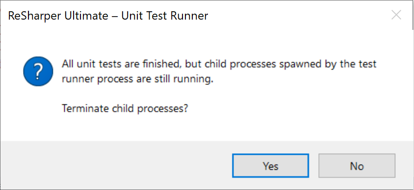
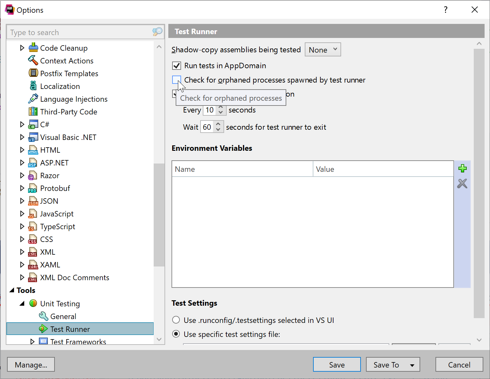

<!--
GENERATED FILE - DO NOT EDIT
This file was generated by [MarkdownSnippets](https://github.com/SimonCropp/MarkdownSnippets).
Source File: /docs/mdsource/diff-tool.source.md
To change this file edit the source file and then run MarkdownSnippets.
-->

# Diff Tools


## Initial difference behavior

Behavior when an input is verified for the first time.

Behavior depends on if an [EmptyFiles](https://github.com/SimonCropp/EmptyFiles) can be found matching the current extension.

 * If an EmptyFiles can be found matching the current extension, then the tool will be launch to compare the input to that empty file.
 * If no EmptyFiles can be found no tool will be launched.


## Detected difference behavior

Behavior when a difference is detected between the input an existing current verified file.


### Not Running

If no tool is running for the comparison of the current verification (per test), a new tool instance will be launched.


### Is Running

If a tool is running for the comparison of the current verification (per test), and a new verification fails, the following logic will be applied:

| Auto Refresh | Mdi   | Behavior |
|--------------|-------|----------|
| true         | true  | No action. Current instance will refresh |
| true         | false | No action. Current instance will refresh |
| false        | true  | Open new instance. Previous instance must be manually closed |
| false        | false | Kill current and open new instance |

This allows, in most cases, for no manual closing of the tool to be required. <!-- singleLineInclude: diffToolCleanup. path: /docs/mdsource/diffToolCleanup.include.md -->


## MaxInstancesToLaunch

By default a maximum of 5 tool instances will be launched. This prevents a change that break many test from causing too much load on a machine.

This value can be changed:


### Using an environment variable

Setting the `DiffEngine_MaxInstances` environment variable to the number of instances to launch.


### Using code

<!-- snippet: MaxInstancesToLaunch -->
<a id='snippet-maxinstancestolaunch'></a>
```cs
DiffRunner.MaxInstancesToLaunch(10);
```
<sup><a href='/src/DiffEngine.Tests/DiffToolsTest.cs#L15-L19' title='Snippet source file'>snippet source</a> | <a href='#snippet-maxinstancestolaunch' title='Start of snippet'>anchor</a></sup>
<!-- endSnippet -->


## Successful verification behavior

If a tool is running for the comparison of the current verification (per test), and a new verification passes, the following logic will be applied:

| Mdi   | Behavior |
|-------|----------|
| true  | No action taken. Previous instance must be manually closed |
| false | Kill current instance |

This allows, in most cases, for no manual closing of the tool to be required. <!-- singleLineInclude: diffToolCleanup. path: /docs/mdsource/diffToolCleanup.include.md -->


## Disable orphaned process detection

Resharper has a feature [Check for orphaned processes spawned by test runner](https://www.jetbrains.com/help/resharper/Reference__Options__Tools__Unit_Testing__Test_Runner.html).

> By default, ReSharper maintains a list of all processes that are launched by the executed tests. If some of theses processes do not exit after the test execution is over, ReSharper will suggest you to terminate the process. If your setup requires some processes started by the tests to continue running, you can clear this checkbox to avoid unnecessary notifications.

Since this project launches diff tools, it will trigger this feature an a dialog will show:

> All unit tests are finished, but chid processes spawned by the test runner proces are still running. Terminate child process?



As such this feature needs to be disabled:

ReSharper | Options | Tools | Unit Testing | Test Runner




## Supported Tools:

 <!-- include: diffTools. path: /src/DiffEngine.Tests/diffTools.include.md -->

## [AraxisMerge](https://www.araxis.com/merge)

  * Is MDI: True
  * Supports auto-refresh: True
  * Supports text files: True
  * Supported binaries: bmp, dib, emf, gif, jif, j2c, j2k, jp2, jpc, jpeg, jpg, jpx, pbm, pcx, pgm, png, ppm, ras, tif, tiff, tga, wmf

### Notes:

 * [Supported image files](https://www.araxis.com/merge/documentation-windows/comparing-image-files.en)
 * [Windows command line usage](https://www.araxis.com/merge/documentation-windows/command-line.en)
 * [MacOS command line usage](https://www.araxis.com/merge/documentation-os-x/command-line.en)
 * [Installing MacOS command line](https://www.araxis.com/merge/documentation-os-x/installing.en)

### Windows settings:

 * Example arguments: `/nowait "tempFile" "targetFile"`
 * Scanned paths:

   * `%ProgramFiles%\Araxis\Araxis Merge\Compare.exe`
   * `%ProgramW6432%\Araxis\Araxis Merge\Compare.exe`
   * `%ProgramFiles(x86)%\Araxis\Araxis Merge\Compare.exe`

### OSX settings:

 * Example arguments: `-nowait "tempFile" "targetFile"`
 * Scanned path: `/Applications/Araxis Merge.app/Contents/Utilities/compare`


## [BeyondCompare](https://www.scootersoftware.com)

  * Is MDI: False
  * Supports auto-refresh: True
  * Supports text files: True
  * Supported binaries: mp3, xls, xlsm, xlsx, doc, docm, docx, dot, dotm, dotx, pdf, bmp, gif, ico, jpg, jpeg, png, tif, tiff, rtf

### Notes:

 * [Command line reference](https://www.scootersoftware.com/v4help/index.html?command_line_reference.html)

### Windows settings:

 * Example arguments: `/solo /leftreadonly "tempFile" "targetFile"`
 * Scanned paths:

   * `%ProgramFiles%\Beyond Compare *\BCompare.exe`
   * `%ProgramW6432%\Beyond Compare *\BCompare.exe`
   * `%ProgramFiles(x86)%\Beyond Compare *\BCompare.exe`

### OSX settings:

 * Example arguments: `-solo -leftreadonly "tempFile" "targetFile"`
 * Scanned path: `/Applications/Beyond Compare.app/Contents/MacOS/bcomp`

### Linux settings:

 * Example arguments: `-solo -leftreadonly "tempFile" "targetFile"`
 * Scanned path: `/usr/lib/beyondcompare/bcomp`


## [CodeCompare](https://www.devart.com/codecompare/)

  * Is MDI: True
  * Supports auto-refresh: False
  * Supports text files: True

### Notes:

 * [Command line reference](https://www.devart.com/codecompare/docs/index.html?comparing_via_command_line.htm)

### Windows settings:

 * Example arguments: `"tempFile" "targetFile"`
 * Scanned paths:

   * `%ProgramFiles%\Devart\Code Compare\CodeCompare.exe`
   * `%ProgramW6432%\Devart\Code Compare\CodeCompare.exe`
   * `%ProgramFiles(x86)%\Devart\Code Compare\CodeCompare.exe`


## [DeltaWalker](https://www.deltawalker.com/)

  * Is MDI: False
  * Supports auto-refresh: False
  * Supports text files: True
  * Supported binaries: jpg, jp2, j2k, png, gif, psd, tif, bmp, pct, pict, pic, ico, ppm, pgm, pbm, pnm, zip, jar, ear, tar, tgz, tbz2, gz, bz2, doc, docx, xls, xlsx, ppt, pdf, rtf, html, htm

### Notes:

 * [Command line usage](https://www.deltawalker.com/integrate/command-line)

### Windows settings:

 * Example arguments: `-mi "tempFile" "targetFile"`
 * Scanned path: `C:\Program Files\Deltopia\DeltaWalker\DeltaWalker.exe`

### OSX settings:

 * Example arguments: `-mi "tempFile" "targetFile"`
 * Scanned path: `/Applications/DeltaWalker.app/Contents/MacOS/DeltaWalker`


## [Diffinity](https://truehumandesign.se/s_diffinity.php)

  * Is MDI: False
  * Supports auto-refresh: True
  * Supports text files: True

### Notes:

 * Disable single instance:
   \ Preferences \ Tabs \ uncheck `Use single instance and open new diffs in tabs`.

### Windows settings:

 * Example arguments: `"tempFile" "targetFile"`
 * Scanned paths:

   * `%ProgramFiles%\Diffinity\Diffinity.exe`
   * `%ProgramW6432%\Diffinity\Diffinity.exe`
   * `%ProgramFiles(x86)%\Diffinity\Diffinity.exe`


## [DiffMerge](https://www.sourcegear.com/diffmerge/)

  * Is MDI: False
  * Supports auto-refresh: False
  * Supports text files: True

### Windows settings:

 * Example arguments: `--nosplash "tempFile" "targetFile"`
 * Scanned paths:

   * `%ProgramFiles%\SourceGear\Common\DiffMerge\sgdm.exe`
   * `%ProgramW6432%\SourceGear\Common\DiffMerge\sgdm.exe`
   * `%ProgramFiles(x86)%\SourceGear\Common\DiffMerge\sgdm.exe`

### OSX settings:

 * Example arguments: `--nosplash "tempFile" "targetFile"`
 * Scanned path: `/Applications/DiffMerge.app/Contents/MacOS/DiffMerge`

### Linux settings:

 * Example arguments: `--nosplash "tempFile" "targetFile"`
 * Scanned path: `/usr/bin/diffmerge`


## [ExamDiff](https://www.prestosoft.com/edp_examdiffpro.asp)

  * Is MDI: False
  * Supports auto-refresh: True
  * Supports text files: True

### Notes:

 * [Command line reference](https://www.prestosoft.com/ps.asp?page=htmlhelp/edp/command_line_options)
 * `/nh`: do not add files or directories to comparison history
 * `/diffonly`: diff-only merge mode: hide the merge pane

### Windows settings:

 * Example arguments: `"tempFile" "targetFile" /nh /diffonly /dn1:tempFile /dn2:targetFile`
 * Scanned paths:

   * `%ProgramFiles%\ExamDiff Pro\ExamDiff.exe`
   * `%ProgramW6432%\ExamDiff Pro\ExamDiff.exe`
   * `%ProgramFiles(x86)%\ExamDiff Pro\ExamDiff.exe`


## [Guiffy](https://www.guiffy.com/)

  * Is MDI: False
  * Supports auto-refresh: False
  * Supports text files: True
  * Supported binaries: bmp, gif, jpeg, jpg, png, wbmp

### Notes:

 * [Command line reference](https://www.guiffy.com/help/GuiffyHelp/GuiffyCmd.html)
 * [Image Diff Tool](https://www.guiffy.com/Image-Diff-Tool.html)
 * `-ge1`: Forbid 1st file view Editing

### Windows settings:

 * Example arguments: `"tempFile" "targetFile" -ge1`
 * Scanned paths:

   * `%ProgramFiles%\Guiffy\guiffy.exe`
   * `%ProgramW6432%\Guiffy\guiffy.exe`
   * `%ProgramFiles(x86)%\Guiffy\guiffy.exe`

### OSX settings:

 * Example arguments: `"tempFile" "targetFile" -ge1`
 * Scanned path: `/Applications/Guiffy/guiffyCL.command`


## [Kaleidoscope](https://www.kaleidoscopeapp.com/)

  * Is MDI: False
  * Supports auto-refresh: False
  * Supports text files: True
  * Supported binaries: bmp, gif, ico, jpg, jpeg, png, tiff, tif

### OSX settings:

 * Example arguments: `"tempFile" "targetFile"`
 * Scanned path: `/usr/local/bin/ksdiff`


## [KDiff3](https://github.com/KDE/kdiff3)

  * Is MDI: False
  * Supports auto-refresh: False
  * Supports text files: True

### Notes:

 * `--cs CreateBakFiles=0` to not save a `.orig` file when merging

### Windows settings:

 * Example arguments: `"tempFile" "targetFile" --cs CreateBakFiles=0`
 * Scanned paths:

   * `%ProgramFiles%\KDiff3\kdiff3.exe`
   * `%ProgramW6432%\KDiff3\kdiff3.exe`
   * `%ProgramFiles(x86)%\KDiff3\kdiff3.exe`

### OSX settings:

 * Example arguments: `"tempFile" "targetFile" --cs CreateBakFiles=0`
 * Scanned path: `/Applications/kdiff3.app/Contents/MacOS/kdiff3`


## [Meld](https://meldmerge.org/)

  * Is MDI: False
  * Supports auto-refresh: False
  * Supports text files: True

### Windows settings:

 * Example arguments: `"tempFile" "targetFile"`
 * Scanned paths:

   * `%ProgramFiles%\Meld\meld.exe`
   * `%ProgramW6432%\Meld\meld.exe`
   * `%ProgramFiles(x86)%\Meld\meld.exe`

### OSX settings:

 * Example arguments: `"tempFile" "targetFile"`
 * Scanned path: `/Applications/meld.app/Contents/MacOS/meld`

### Linux settings:

 * Example arguments: `"tempFile" "targetFile"`
 * Scanned path: `/usr/bin/meld`


## [Neovim](https://neovim.io/)

  * Is MDI: False
  * Supports auto-refresh: False
  * Supports text files: True

### Notes:

 * Assumes installed through Chocolatey https://chocolatey.org/packages/neovim/

### Windows settings:

 * Example arguments: `-d "tempFile" "targetFile"`
 * Scanned path: `%ChocolateyToolsLocation%\neovim\*\nvim.exe`


## [P4Merge](https://www.perforce.com/products/helix-core-apps/merge-diff-tool-p4merge)

  * Is MDI: False
  * Supports auto-refresh: False
  * Supports text files: True
  * Supported binaries: bmp, gif, jpg, jpeg, png, pbm, pgm, ppm, tif, tiff, xbm, xpm

### Windows settings:

 * Example arguments: `"tempFile" "targetFile"`
 * Scanned paths:

   * `%ProgramFiles%\Perforce\p4merge.exe`
   * `%ProgramW6432%\Perforce\p4merge.exe`
   * `%ProgramFiles(x86)%\Perforce\p4merge.exe`

### OSX settings:

 * Example arguments: `"tempFile" "targetFile"`
 * Scanned path: `/Applications/p4merge.app/Contents/MacOS/p4merge`

### Linux settings:

 * Example arguments: `"tempFile" "targetFile"`
 * Scanned path: `/usr/bin/p4merge`


## [Rider](https://www.jetbrains.com/rider/)

  * Is MDI: False
  * Supports auto-refresh: False
  * Supports text files: True

### Notes:

 * https://www.jetbrains.com/help/rider/Command_Line_Differences_Viewer.html

### Windows settings:

 * Example arguments: ` diff "tempFile" "targetFile"`
 * Scanned paths:

   * `%ProgramFiles%\JetBrains\JetBrains Rider *\bin\rider64.exe`
   * `%ProgramW6432%\JetBrains\JetBrains Rider *\bin\rider64.exe`
   * `%ProgramFiles(x86)%\JetBrains\JetBrains Rider *\bin\rider64.exe`
   * `%JetBrains Rider%\rider64.exe`
   * `%LOCALAPPDATA%\JetBrains\Toolbox\apps\Rider\*\*\bin\rider64.exe`

### OSX settings:

 * Example arguments: ` diff "tempFile" "targetFile"`
 * Scanned paths:

   * `%HOME%/Library/Application Support/JetBrains/Toolbox/apps/Rider/*/*/Rider EAP.app/Contents/MacOS/rider`
   * `%HOME%/Library/Application Support/JetBrains/Toolbox/apps/Rider/*/*/Rider.app/Contents/MacOS/rider`
   * `/Applications/Rider EAP.app/Contents/MacOS/rider`
   * `/Applications/Rider.app/Contents/MacOS/rider`


## [SublimeMerge](https://www.sublimemerge.com/)

  * Is MDI: False
  * Supports auto-refresh: False
  * Supports text files: True

### Windows settings:

 * Example arguments: `mergetool "tempFile" "targetFile"`
 * Scanned paths:

   * `%ProgramFiles%\Sublime Merge\smerge.exe`
   * `%ProgramW6432%\Sublime Merge\smerge.exe`
   * `%ProgramFiles(x86)%\Sublime Merge\smerge.exe`

### OSX settings:

 * Example arguments: `mergetool "tempFile" "targetFile"`
 * Scanned path: `/Applications/smerge.app/Contents/MacOS/smerge`

### Linux settings:

 * Example arguments: `mergetool "tempFile" "targetFile"`
 * Scanned path: `/usr/bin/smerge`


## [TkDiff](https://sourceforge.net/projects/tkdiff/)

  * Is MDI: False
  * Supports auto-refresh: False
  * Supports text files: True

### OSX settings:

 * Example arguments: `"tempFile" "targetFile"`
 * Scanned path: `/Applications/TkDiff.app/Contents/MacOS/tkdiff`


## [TortoiseGitMerge](https://tortoisegit.org/docs/tortoisegitmerge/)

  * Is MDI: False
  * Supports auto-refresh: False
  * Supports text files: True

### Windows settings:

 * Example arguments: `"tempFile" "targetFile"`
 * Scanned paths:

   * `%ProgramFiles%\TortoiseGit\bin\TortoiseGitMerge.exe`
   * `%ProgramW6432%\TortoiseGit\bin\TortoiseGitMerge.exe`
   * `%ProgramFiles(x86)%\TortoiseGit\bin\TortoiseGitMerge.exe`


## [TortoiseIDiff](https://tortoisesvn.net/TortoiseIDiff.html)

  * Is MDI: False
  * Supports auto-refresh: False
  * Supports text files: False
  * Supported binaries: bmp, gif, ico, jpg, jpeg, png, tif, tiff

### Windows settings:

 * Example arguments: `/left:"tempFile" /right:"targetFile"`
 * Scanned paths:

   * `%ProgramFiles%\TortoiseSVN\bin\TortoiseIDiff.exe`
   * `%ProgramW6432%\TortoiseSVN\bin\TortoiseIDiff.exe`
   * `%ProgramFiles(x86)%\TortoiseSVN\bin\TortoiseIDiff.exe`


## [TortoiseMerge](https://tortoisesvn.net/TortoiseMerge.html)

  * Is MDI: False
  * Supports auto-refresh: False
  * Supports text files: True

### Windows settings:

 * Example arguments: `"tempFile" "targetFile"`
 * Scanned paths:

   * `%ProgramFiles%\TortoiseSVN\bin\TortoiseMerge.exe`
   * `%ProgramW6432%\TortoiseSVN\bin\TortoiseMerge.exe`
   * `%ProgramFiles(x86)%\TortoiseSVN\bin\TortoiseMerge.exe`


## [Vim](https://www.vim.org/)

  * Is MDI: False
  * Supports auto-refresh: True
  * Supports text files: True

### Notes:

 * [Options](http://vimdoc.sourceforge.net/htmldoc/options.html)
 * [Vim help files](https://vimhelp.org/)
 * [autoread](http://vimdoc.sourceforge.net/htmldoc/options.html#'autoread')
 * [nobackup](http://vimdoc.sourceforge.net/htmldoc/options.html#'backup')
 * [noswapfile](http://vimdoc.sourceforge.net/htmldoc/options.html#'swapfile')

### Windows settings:

 * Example arguments: `-d "tempFile" "targetFile" -c "setl autoread | setl nobackup | set noswapfile"`
 * Scanned paths:

   * `%ProgramFiles%\Vim\*\vim.exe`
   * `%ProgramW6432%\Vim\*\vim.exe`
   * `%ProgramFiles(x86)%\Vim\*\vim.exe`

### OSX settings:

 * Example arguments: `-d "tempFile" "targetFile" -c "setl autoread | setl nobackup | set noswapfile"`
 * Scanned path: `/Applications/MacVim.app/Contents/bin/mvim`


## [VisualStudio](https://docs.microsoft.com/en-us/visualstudio/ide/reference/diff)

  * Is MDI: True
  * Supports auto-refresh: True
  * Supports text files: True

### Windows settings:

 * Example arguments: `/diff "tempFile" "targetFile"`
 * Scanned paths:

   * `%ProgramFiles(x86)%\Microsoft Visual Studio\2019\Preview\Common7\IDE\devenv.exe`
   * `%ProgramFiles(x86)%\Microsoft Visual Studio\2019\Community\Common7\IDE\devenv.exe`
   * `%ProgramFiles(x86)%\Microsoft Visual Studio\2019\Professional\Common7\IDE\devenv.exe`
   * `%ProgramFiles(x86)%\Microsoft Visual Studio\2019\Enterprise\Common7\IDE\devenv.exe`


## [VisualStudioCode](https://code.visualstudio.com)

  * Is MDI: True
  * Supports auto-refresh: True
  * Supports text files: True

### Notes:

 * [Command line reference](https://code.visualstudio.com/docs/editor/command-line)

### Windows settings:

 * Example arguments: `--diff "targetFile" "tempFile"`
 * Scanned paths:

   * `%LocalAppData%\Programs\Microsoft VS Code\code.exe`
   * `%ProgramFiles%\Microsoft VS Code\bin\code.exe`
   * `%ProgramW6432%\Microsoft VS Code\bin\code.exe`
   * `%ProgramFiles(x86)%\Microsoft VS Code\bin\code.exe`
   * `%ProgramFiles%\Microsoft VS Code\code.exe`
   * `%ProgramW6432%\Microsoft VS Code\code.exe`
   * `%ProgramFiles(x86)%\Microsoft VS Code\code.exe`

### OSX settings:

 * Example arguments: `--diff "targetFile" "tempFile"`
 * Scanned path: `/Applications/Visual Studio Code.app/Contents/Resources/app/bin/code`

### Linux settings:

 * Example arguments: `--diff "targetFile" "tempFile"`
 * Scanned path: `/usr/local/bin/code`


## [WinMerge](https://winmerge.org/)

  * Is MDI: False
  * Supports auto-refresh: True
  * Supports text files: True

### Notes:

 * [Command line reference](https://manual.winmerge.org/en/Command_line.html).
 * `/u` Prevents WinMerge from adding paths to the Most Recently Used (MRU) list.
 * `/wl` Opens the left side as read-only.
 * `/dl` and `/dr` Specifies file descriptions in the title bar.
 * `/e` Enables close with a single Esc key press.

### Windows settings:

 * Example arguments: `/u /wl /e "tempFile" "targetFile" /dl "tempFile" /dr "targetFile"`
 * Scanned paths:

   * `%ProgramFiles%\WinMerge\WinMergeU.exe`
   * `%ProgramW6432%\WinMerge\WinMergeU.exe`
   * `%ProgramFiles(x86)%\WinMerge\WinMergeU.exe` <!-- endInclude -->
