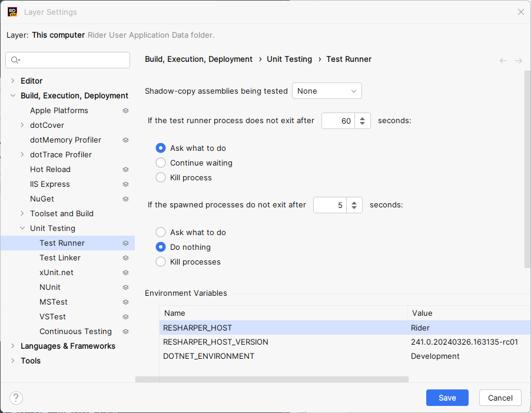

<!--
GENERATED FILE - DO NOT EDIT
This file was generated by [MarkdownSnippets](https://github.com/SimonCropp/MarkdownSnippets).
Source File: /docs/mdsource/diff-tool.source.md
To change this file edit the source file and then run MarkdownSnippets.
-->

# Diff Tools


## Initial difference behavior

Behavior when an input is verified for the first time.

Behavior depends on if an [EmptyFiles](https://github.com/SimonCropp/EmptyFiles) can be found matching the current extension.

 * If an EmptyFiles can be found matching the current extension, then the tool will be launched to compare the input to that empty file.
 * If no EmptyFiles can be found no tool will be launched.


## Detected difference behavior

Behavior when a difference is detected between the input and an existing current verified file.


### Not Running

If no tool is running for the comparison of the current verification (per test), a new tool instance will be launched.


### Is Running

If a tool is running for the comparison of the current verification (per test), and a new verification fails, the following logic will be applied:

| Auto Refresh | Mdi   | Behavior |
|--------------|-------|----------|
| true         | true  | No action. Current instance will refresh |
| true         | false | No action. Current instance will refresh |
| false        | true  | Open new instance. Previous instance must be manually closed |
| false        | false | Kill current and open new instance |

This allows, in most cases, for no manual closing of the tool to be required.<!-- singleLineInclude: diffToolCleanup. path: /docs/mdsource/diffToolCleanup.include.md -->


## MaxInstancesToLaunch

By default a maximum of 5 tool instances will be launched. This prevents a change that breaks many tests from causing too much load on a machine.

This value can be changed using an environment variable or by explicitly specifying the value by code. When both are used, the environment variable value will be used.


### Using an environment variable

Setting the `DiffEngine_MaxInstances` environment variable to the number of instances to launch.

This value can also be set using [the DiffEngineTray options dialog](/docs/tray.md#max-instances-to-launch).


### Using code

<!-- snippet: MaxInstancesToLaunch -->
<a id='snippet-MaxInstancesToLaunch'></a>
```cs
DiffRunner.MaxInstancesToLaunch(10);
```
<sup><a href='/src/DiffEngine.Tests/DiffToolsTest.cs#L6-L8' title='Snippet source file'>snippet source</a> | <a href='#snippet-MaxInstancesToLaunch' title='Start of snippet'>anchor</a></sup>
<!-- endSnippet -->


## Left/Right diff behavior

By default, when a diff is opened, the temp file is on the left and the target file is on the right.

This value can be changed by setting the `DiffEngine_TargetOnLeft` environment variable to `true`.

This value can also be set using [the DiffEngineTray options dialog](/docs/tray.md#open-on-left).


## Successful verification behavior

If a tool is running for the comparison of the current verification (per test), and a new verification passes, the following logic will be applied:

| Mdi   | Behavior |
|-------|----------|
| true  | No action taken. Previous instance must be manually closed |
| false | Kill current instance |

This allows, in most cases, for no manual closing of the tool to be required.<!-- singleLineInclude: diffToolCleanup. path: /docs/mdsource/diffToolCleanup.include.md -->


## Disable orphaned process detection

Resharper has a feature [Check for orphaned processes spawned by test runner](https://www.jetbrains.com/help/resharper/Reference__Options__Tools__Unit_Testing__Test_Runner.html).

> By default, ReSharper maintains a list of all processes that are launched by the executed tests. If some of theses processes do not exit after the test execution is over, ReSharper will suggest you to terminate the process. If your setup requires some processes started by the tests to continue running, you can clear this checkbox to avoid unnecessary notifications.

Since this project launches diff tools, it will trigger this feature and a dialog will show:

> All unit tests are finished, but child processes spawned by the test runner process are still running. Terminate child process?


As such this feature needs to be disabled:


### Disable for solution

Add the following to `[Solution].sln.DotSettings`.

```
<s:String x:Key="/Default/Housekeeping/UnitTestingMru/UnitTestRunner/SpawnedProcessesResponse/@EntryValue">DoNothing</s:String>
```


### Disable for machine


#### Resharper

ReSharper | Options | Tools | Unit Testing | Test Runner


#### Rider

File | Settings | Manage Layers | This computer | Edit Layer | Build, Execution, Deployment | Unit Testing | Test Runner




## Supported Tools:

Tools location is automatically detected. If a tool installed in a custom location, it can be manually configured using an environment variable, that points to the executable. The environment variable format is `DiffEngine_{ToolName}`.

<!-- include: diffTools. path: /src/DiffEngine.Tests/diffTools.include.md -->
## Non-MDI tools

Non-MDI tools are preferred since it allows [DiffEngineTray](tray.md) to track and close diffs.


### [BeyondCompare](https://www.scootersoftware.com)

  * Cost: Paid
  * Is MDI: False
  * Supports auto-refresh: True
  * Supports text files: True
  * Create no window: False
  * Environment variable for custom install location: `DiffEngine_BeyondCompare`
  * Supported binaries: .bmp, .gif, .ico, .jpeg, .jpg, .pdf, .png, .rtf, .svg, .tif, .tiff

#### Notes:

 * [Command line reference](https://www.scootersoftware.com/v4help/index.html?command_line_reference.html)
 * Enable [Automatically reload unless changes will be discarded](https://www.scootersoftware.com/v4help/optionstweak.html) in `Tools > Options > Tweaks > File Operations`.

#### Windows settings:

  * Example target on left arguments: `/solo /rightreadonly /nobackups "targetFile.txt" "tempFile.txt" `
  * Example target on right arguments: `/solo /leftreadonly /nobackups "tempFile.txt" "targetFile.txt" `
  * Scanned paths:
    * `%ProgramFiles%\Beyond Compare *\BCompare.exe`
    * `%ProgramW6432%\Beyond Compare *\BCompare.exe`
    * `%ProgramFiles(x86)%\Beyond Compare *\BCompare.exe`
    * `%LOCALAPPDATA%\Programs\Beyond Compare *\BCompare.exe`
    * `%PATH%BCompare.exe`

#### OSX settings:

  * Example target on left arguments: `-solo -rightreadonly -nobackups "targetFile.txt" "tempFile.txt" `
  * Example target on right arguments: `-solo -leftreadonly -nobackups "tempFile.txt" "targetFile.txt" `
  * Scanned paths:
    * `/Applications/Beyond Compare.app/Contents/MacOS/bcomp`
    * `%PATH%bcomp`

#### Linux settings:

  * Example target on left arguments: `-solo -rightreadonly -nobackups "targetFile.txt" "tempFile.txt" `
  * Example target on right arguments: `-solo -leftreadonly -nobackups "tempFile.txt" "targetFile.txt" `
  * Scanned paths:
    * `/usr/bin/bcompare`
    * `%PATH%bcompare`

### [DeltaWalker](https://www.deltawalker.com/)

  * Cost: Paid
  * Is MDI: False
  * Supports auto-refresh: True
  * Supports text files: True
  * Create no window: False
  * Environment variable for custom install location: `DiffEngine_DeltaWalker`
  * Supported binaries: .bmp, .bz2, .doc, .docx, .ear, .gif, .gz, .htm, .html, .ico, .j2k, .jar, .jp2, .jpg, .pbm, .pct, .pdf, .pgm, .pic, .pict, .png, .pnm, .ppm, .ppt, .psd, .rtf, .svg, .tar, .tbz2, .tgz, .tif, .xls, .xlsx, .zip

#### Notes:

 * [Command line usage](https://www.deltawalker.com/integrate/command-line)

#### Windows settings:

  * Example target on left arguments: `-mi "targetFile.txt" "tempFile.txt" `
  * Example target on right arguments: `-mi "tempFile.txt" "targetFile.txt" `
  * Scanned paths:
    * `%ProgramFiles%\Deltopia\DeltaWalker\DeltaWalker.exe`
    * `%ProgramW6432%\Deltopia\DeltaWalker\DeltaWalker.exe`
    * `%ProgramFiles(x86)%\Deltopia\DeltaWalker\DeltaWalker.exe`
    * `%PATH%DeltaWalker.exe`

#### OSX settings:

  * Example target on left arguments: `-mi "targetFile.txt" "tempFile.txt" `
  * Example target on right arguments: `-mi "tempFile.txt" "targetFile.txt" `
  * Scanned paths:
    * `/Applications/DeltaWalker.app/Contents/MacOS/DeltaWalker`
    * `%PATH%DeltaWalker`

### [Diffinity](https://truehumandesign.se/s_diffinity.php)

  * Cost: Free with option to donate
  * Is MDI: False
  * Supports auto-refresh: True
  * Supports text files: True
  * Create no window: False
  * Environment variable for custom install location: `DiffEngine_Diffinity`
  * Supported binaries: .svg

#### Windows settings:

  * Example target on left arguments: `"targetFile.txt" "tempFile.txt" -forceNewInstance `
  * Example target on right arguments: `"tempFile.txt" "targetFile.txt" -forceNewInstance `
  * Scanned paths:
    * `%ProgramFiles%\Diffinity\Diffinity.exe`
    * `%ProgramW6432%\Diffinity\Diffinity.exe`
    * `%ProgramFiles(x86)%\Diffinity\Diffinity.exe`
    * `%PATH%Diffinity.exe`

### [ExamDiff](https://www.prestosoft.com/edp_examdiffpro.asp)

  * Cost: Paid
  * Is MDI: False
  * Supports auto-refresh: True
  * Supports text files: True
  * Create no window: False
  * Environment variable for custom install location: `DiffEngine_ExamDiff`
  * Supported binaries: .svg

#### Notes:

 * [Command line reference](https://www.prestosoft.com/ps.asp?page=htmlhelp/edp/command_line_options)
 * `/nh`: do not add files or directories to comparison history
 * `/diffonly`: diff-only merge mode: hide the merge pane

#### Windows settings:

  * Example target on left arguments: `"targetFile.txt" "tempFile.txt" /nh /diffonly /dn1:targetFile.txt /dn2:tempFile.txt `
  * Example target on right arguments: `"tempFile.txt" "targetFile.txt" /nh /diffonly /dn1:tempFile.txt /dn2:targetFile.txt `
  * Scanned paths:
    * `%ProgramFiles%\ExamDiff Pro\ExamDiff.exe`
    * `%ProgramW6432%\ExamDiff Pro\ExamDiff.exe`
    * `%ProgramFiles(x86)%\ExamDiff Pro\ExamDiff.exe`
    * `%PATH%ExamDiff.exe`

### [Guiffy](https://www.guiffy.com/)

  * Cost: Paid
  * Is MDI: False
  * Supports auto-refresh: False
  * Supports text files: True
  * Create no window: False
  * Environment variable for custom install location: `DiffEngine_Guiffy`
  * Supported binaries: .bmp, .gif, .jpeg, .jpg, .png, .svg, .wbmp

#### Notes:

 * [Command line reference](https://www.guiffy.com/help/GuiffyHelp/GuiffyCmd.html)
 * [Image Diff Tool](https://www.guiffy.com/Image-Diff-Tool.html)
 * `-ge1`: Forbid first file view Editing
 * `-ge2`: Forbid second file view Editing

#### Windows settings:

  * Example target on left arguments: `"targetFile.txt" "tempFile.txt" -ge2 `
  * Example target on right arguments: `"tempFile.txt" "targetFile.txt" -ge1 `
  * Scanned paths:
    * `%ProgramFiles%\Guiffy\guiffy.exe`
    * `%ProgramW6432%\Guiffy\guiffy.exe`
    * `%ProgramFiles(x86)%\Guiffy\guiffy.exe`
    * `%PATH%guiffy.exe`

#### OSX settings:

  * Example target on left arguments: `"targetFile.txt" "tempFile.txt" -ge2 `
  * Example target on right arguments: `"tempFile.txt" "targetFile.txt" -ge1 `
  * Scanned paths:
    * `/Applications/Guiffy/guiffyCL.command`
    * `%PATH%guiffyCL.command`

### [Kaleidoscope](https://kaleidoscope.app)

  * Cost: Paid
  * Is MDI: False
  * Supports auto-refresh: True
  * Supports text files: True
  * Create no window: False
  * Environment variable for custom install location: `DiffEngine_Kaleidoscope`
  * Supported binaries: .bmp, .gif, .ico, .jpeg, .jpg, .png, .svg, .tif, .tiff

#### OSX settings:

  * Example target on left arguments: `"targetFile.txt" "tempFile.txt" `
  * Example target on right arguments: `"tempFile.txt" "targetFile.txt" `
  * Scanned paths:
    * `%PATH%ksdiff`

### [KDiff3](https://github.com/KDE/kdiff3)

  * Cost: Free
  * Is MDI: False
  * Supports auto-refresh: False
  * Supports text files: True
  * Create no window: False
  * Environment variable for custom install location: `DiffEngine_KDiff3`
  * Supported binaries: .svg

#### Notes:

 * `--cs CreateBakFiles=0` to not save a `.orig` file when merging

#### Windows settings:

  * Example target on left arguments: `"targetFile.txt" "tempFile.txt" --cs CreateBakFiles=0 `
  * Example target on right arguments: `"tempFile.txt" "targetFile.txt" --cs CreateBakFiles=0 `
  * Scanned paths:
    * `%ProgramFiles%\KDiff3\bin\kdiff3.exe`
    * `%ProgramW6432%\KDiff3\bin\kdiff3.exe`
    * `%ProgramFiles(x86)%\KDiff3\bin\kdiff3.exe`
    * `%ProgramFiles%\KDiff3\kdiff3.exe`
    * `%ProgramW6432%\KDiff3\kdiff3.exe`
    * `%ProgramFiles(x86)%\KDiff3\kdiff3.exe`
    * `%PATH%kdiff3.exe`

#### OSX settings:

  * Example target on left arguments: `"targetFile.txt" "tempFile.txt" --cs CreateBakFiles=0 `
  * Example target on right arguments: `"tempFile.txt" "targetFile.txt" --cs CreateBakFiles=0 `
  * Scanned paths:
    * `/Applications/kdiff3.app/Contents/MacOS/kdiff3`
    * `%PATH%kdiff3`

### [Neovim](https://neovim.io/)

  * Cost: Free with option to sponsor
  * Is MDI: False
  * Supports auto-refresh: False
  * Supports text files: True
  * Create no window: False
  * Environment variable for custom install location: `DiffEngine_Neovim`
  * Supported binaries: .svg

#### Notes:

 * https://neovim.io/doc/user/diff.html

#### Windows settings:

  * Example target on left arguments: `-d "targetFile.txt" "tempFile.txt" `
  * Example target on right arguments: `-d "tempFile.txt" "targetFile.txt" `
  * Scanned paths:
    * `%PATH%nvim.exe`

#### OSX settings:

  * Example target on left arguments: `-d "targetFile.txt" "tempFile.txt" `
  * Example target on right arguments: `-d "tempFile.txt" "targetFile.txt" `
  * Scanned paths:
    * `%PATH%nvim`

#### Linux settings:

  * Example target on left arguments: `-d "targetFile.txt" "tempFile.txt" `
  * Example target on right arguments: `-d "tempFile.txt" "targetFile.txt" `
  * Scanned paths:
    * `%PATH%nvim`

### [P4Merge](https://www.perforce.com/products/helix-core-apps/merge-diff-tool-p4merge)

  * Cost: Free
  * Is MDI: False
  * Supports auto-refresh: False
  * Supports text files: True
  * Create no window: False
  * Environment variable for custom install location: `DiffEngine_P4Merge`
  * Supported binaries: .bmp, .gif, .jpeg, .jpg, .pbm, .pgm, .png, .ppm, .svg, .tif, .tiff, .xbm, .xpm

#### Windows settings:

  * Example target on left arguments for text: `-C utf8-bom "tempFile.txt" "targetFile.txt" `
  * Example target on right arguments for text: `-C utf8-bom "targetFile.txt" "tempFile.txt" `
  * Example target on left arguments for binary: `"targetFile.png" "tempFile.png" `
  * Example target on right arguments for binary: `"tempFile.png" "targetFile.png" `
  * Scanned paths:
    * `%ProgramFiles%\Perforce\p4merge.exe`
    * `%ProgramW6432%\Perforce\p4merge.exe`
    * `%ProgramFiles(x86)%\Perforce\p4merge.exe`
    * `%PATH%p4merge.exe`

#### OSX settings:

  * Example target on left arguments for text: `-C utf8-bom "tempFile.txt" "targetFile.txt" `
  * Example target on right arguments for text: `-C utf8-bom "targetFile.txt" "tempFile.txt" `
  * Example target on left arguments for binary: `"targetFile.png" "tempFile.png" `
  * Example target on right arguments for binary: `"tempFile.png" "targetFile.png" `
  * Scanned paths:
    * `/Applications/p4merge.app/Contents/MacOS/p4merge`
    * `%PATH%p4merge`

#### Linux settings:

  * Example target on left arguments for text: `-C utf8-bom "tempFile.txt" "targetFile.txt" `
  * Example target on right arguments for text: `-C utf8-bom "targetFile.txt" "tempFile.txt" `
  * Example target on left arguments for binary: `"targetFile.png" "tempFile.png" `
  * Example target on right arguments for binary: `"tempFile.png" "targetFile.png" `
  * Scanned paths:
    * `%PATH%p4merge`

### [Rider](https://www.jetbrains.com/rider/)

  * Cost: Paid with free option for OSS
  * Is MDI: False
  * Supports auto-refresh: True
  * Supports text files: True
  * Create no window: False
  * Environment variable for custom install location: `DiffEngine_Rider`
  * Supported binaries: .svg

#### Notes:

 * https://www.jetbrains.com/help/rider/Command_Line_Differences_Viewer.html

#### Windows settings:

  * Example target on left arguments: `diff "targetFile.txt" "tempFile.txt" `
  * Example target on right arguments: `diff "tempFile.txt" "targetFile.txt" `
  * Scanned paths:
    * `%LOCALAPPDATA%\Programs\Rider*\bin\rider64.exe`
    * `%ProgramFiles%\JetBrains\JetBrains Rider *\bin\rider64.exe`
    * `%ProgramW6432%\JetBrains\JetBrains Rider *\bin\rider64.exe`
    * `%ProgramFiles(x86)%\JetBrains\JetBrains Rider *\bin\rider64.exe`
    * `%PATH%rider.cmd`

#### OSX settings:

  * Example target on left arguments: `diff "targetFile.txt" "tempFile.txt" `
  * Example target on right arguments: `diff "tempFile.txt" "targetFile.txt" `
  * Scanned paths:
    * `/Applications/Rider.app/Contents/MacOS/rider`
    * `/usr/local/bin/rider`
    * `%PATH%rider`

#### Linux settings:

  * Example target on left arguments: `diff "targetFile.txt" "tempFile.txt" `
  * Example target on right arguments: `diff "tempFile.txt" "targetFile.txt" `
  * Scanned paths:
    * `%HOME%/.local/share/JetBrains/Toolbox/apps/rider/bin/rider.sh`
    * `%PATH%rider.sh`

### [TkDiff](https://sourceforge.net/projects/tkdiff/)

  * Cost: Free
  * Is MDI: False
  * Supports auto-refresh: False
  * Supports text files: True
  * Create no window: False
  * Environment variable for custom install location: `DiffEngine_TkDiff`
  * Supported binaries: .svg

#### OSX settings:

  * Example target on left arguments: `"targetFile.txt" "tempFile.txt" `
  * Example target on right arguments: `"tempFile.txt" "targetFile.txt" `
  * Scanned paths:
    * `/Applications/TkDiff.app/Contents/MacOS/tkdiff`
    * `%PATH%tkdiff`

### [TortoiseGitIDiff](https://tortoisegit.org/docs/tortoisegitmerge/)

  * Cost: Free
  * Is MDI: False
  * Supports auto-refresh: False
  * Supports text files: False
  * Create no window: False
  * Environment variable for custom install location: `DiffEngine_TortoiseGitIDiff`
  * Supported binaries: .bmp, .gif, .ico, .jpeg, .jpg, .png, .tif, .tiff

#### Windows settings:

  * Example target on left arguments: `"targetFile.txt" "tempFile.txt" `
  * Example target on right arguments: `"tempFile.txt" "targetFile.txt" `
  * Scanned paths:
    * `%ProgramFiles%\TortoiseGit\bin\TortoiseGitIDiff.exe`
    * `%ProgramW6432%\TortoiseGit\bin\TortoiseGitIDiff.exe`
    * `%ProgramFiles(x86)%\TortoiseGit\bin\TortoiseGitIDiff.exe`
    * `%PATH%TortoiseGitIDiff.exe`

### [TortoiseGitMerge](https://tortoisegit.org/docs/tortoisegitmerge/)

  * Cost: Free
  * Is MDI: False
  * Supports auto-refresh: False
  * Supports text files: True
  * Create no window: False
  * Environment variable for custom install location: `DiffEngine_TortoiseGitMerge`
  * Supported binaries: .svg

#### Windows settings:

  * Example target on left arguments: `"targetFile.txt" "tempFile.txt" `
  * Example target on right arguments: `"tempFile.txt" "targetFile.txt" `
  * Scanned paths:
    * `%ProgramFiles%\TortoiseGit\bin\TortoiseGitMerge.exe`
    * `%ProgramW6432%\TortoiseGit\bin\TortoiseGitMerge.exe`
    * `%ProgramFiles(x86)%\TortoiseGit\bin\TortoiseGitMerge.exe`
    * `%PATH%TortoiseGitMerge.exe`

### [TortoiseIDiff](https://tortoisesvn.net/TortoiseIDiff.html)

  * Cost: Free
  * Is MDI: False
  * Supports auto-refresh: False
  * Supports text files: False
  * Create no window: False
  * Environment variable for custom install location: `DiffEngine_TortoiseIDiff`
  * Supported binaries: .bmp, .gif, .ico, .jpeg, .jpg, .png, .tif, .tiff

#### Windows settings:

  * Example target on left arguments: `/left:"targetFile.txt" /right:"tempFile.txt" `
  * Example target on right arguments: `/left:"tempFile.txt" /right:"targetFile.txt" `
  * Scanned paths:
    * `%ProgramFiles%\TortoiseSVN\bin\TortoiseIDiff.exe`
    * `%ProgramW6432%\TortoiseSVN\bin\TortoiseIDiff.exe`
    * `%ProgramFiles(x86)%\TortoiseSVN\bin\TortoiseIDiff.exe`
    * `%PATH%TortoiseIDiff.exe`

### [TortoiseMerge](https://tortoisesvn.net/TortoiseMerge.html)

  * Cost: Free
  * Is MDI: False
  * Supports auto-refresh: False
  * Supports text files: True
  * Create no window: False
  * Environment variable for custom install location: `DiffEngine_TortoiseMerge`
  * Supported binaries: .svg

#### Windows settings:

  * Example target on left arguments: `"targetFile.txt" "tempFile.txt" `
  * Example target on right arguments: `"tempFile.txt" "targetFile.txt" `
  * Scanned paths:
    * `%ProgramFiles%\TortoiseSVN\bin\TortoiseMerge.exe`
    * `%ProgramW6432%\TortoiseSVN\bin\TortoiseMerge.exe`
    * `%ProgramFiles(x86)%\TortoiseSVN\bin\TortoiseMerge.exe`
    * `%PATH%TortoiseMerge.exe`

### [Vim](https://www.vim.org/)

  * Cost: Free with option to donate
  * Is MDI: False
  * Supports auto-refresh: True
  * Supports text files: True
  * Create no window: False
  * Environment variable for custom install location: `DiffEngine_Vim`
  * Supported binaries: .svg

#### Notes:

 * [Options](http://vimdoc.sourceforge.net/htmldoc/options.html)
 * [Vim help files](https://vimhelp.org/)
 * [autoread](http://vimdoc.sourceforge.net/htmldoc/options.html#'autoread')
 * [nobackup](http://vimdoc.sourceforge.net/htmldoc/options.html#'backup')
 * [noswapfile](http://vimdoc.sourceforge.net/htmldoc/options.html#'swapfile')

#### Windows settings:

  * Example target on left arguments: `-d "targetFile.txt" "tempFile.txt" -c "setl autoread | setl nobackup | set noswapfile" `
  * Example target on right arguments: `-d "tempFile.txt" "targetFile.txt" -c "setl autoread | setl nobackup | set noswapfile" `
  * Scanned paths:
    * `%ProgramFiles%\Vim\*\vim.exe`
    * `%ProgramW6432%\Vim\*\vim.exe`
    * `%ProgramFiles(x86)%\Vim\*\vim.exe`
    * `%PATH%vim.exe`

#### OSX settings:

  * Example target on left arguments: `-d "targetFile.txt" "tempFile.txt" -c "setl autoread | setl nobackup | set noswapfile" `
  * Example target on right arguments: `-d "tempFile.txt" "targetFile.txt" -c "setl autoread | setl nobackup | set noswapfile" `
  * Scanned paths:
    * `/Applications/MacVim.app/Contents/bin/mvim`
    * `%PATH%mvim`

### [WinMerge](https://winmerge.org/)

  * Cost: Free with option to donate
  * Is MDI: False
  * Supports auto-refresh: True
  * Supports text files: True
  * Create no window: False
  * Environment variable for custom install location: `DiffEngine_WinMerge`
  * Supported binaries: .bmp, .bw, .cut, .dds, .exr, .g3, .gif, .hdp, .hdr, .ico, .iff, .j2c, .j2k, .jif, .jng, .jp2, .jpe, .jpeg, .jpg, .jxr, .koa, .lbm, .mng, .pbm, .pcd, .pct, .pcx, .pfm, .pgm, .pic, .pict, .png, .ppm, .psd, .ras, .rgb, .rgba, .sgi, .svg, .targa, .tga, .tif, .tiff, .wap, .wbm, .wbmp, .wdp, .webp, .xbm, .xpm

#### Notes:

 * [Command line reference](https://manual.winmerge.org/en/Command_line.html).
 * `/u` Prevents WinMerge from adding paths to the Most Recently Used (MRU) list.
 * `/wl` Opens the left side as read-only.
 * `/dl` and `/dr` Specifies file descriptions in the title bar.
 * `/e` Enables close with a single Esc key press.
 * `/cfg Backup/EnableFile=0` disable backup files.

#### Windows settings:

  * Example target on left arguments: `/u /wr /e "targetFile.txt" "tempFile.txt" /dl "targetFile.txt" /dr "tempFile.txt" /cfg Backup/EnableFile=0 `
  * Example target on right arguments: `/u /wl /e "tempFile.txt" "targetFile.txt" /dl "tempFile.txt" /dr "targetFile.txt" /cfg Backup/EnableFile=0 `
  * Scanned paths:
    * `%ProgramFiles%\WinMerge\WinMergeU.exe`
    * `%ProgramW6432%\WinMerge\WinMergeU.exe`
    * `%ProgramFiles(x86)%\WinMerge\WinMergeU.exe`
    * `%LocalAppData%\Programs\WinMerge\WinMergeU.exe`
    * `%PATH%WinMergeU.exe`

## MDI tools


### [AraxisMerge](https://www.araxis.com/merge)

  * Cost: Paid
  * Is MDI: True
  * Supports auto-refresh: True
  * Supports text files: True
  * Create no window: False
  * Environment variable for custom install location: `DiffEngine_AraxisMerge`
  * Supported binaries: .bmp, .dib, .emf, .gif, .j2c, .j2k, .jif, .jp2, .jpc, .jpeg, .jpg, .jpx, .pbm, .pcx, .pgm, .png, .ppm, .ras, .svg, .tga, .tif, .tiff, .wmf

#### Notes:

 * [Supported image files](https://www.araxis.com/merge/documentation-windows/comparing-image-files.en)
 * [Windows command line usage](https://www.araxis.com/merge/documentation-windows/command-line.en)
 * [MacOS command line usage](https://www.araxis.com/merge/documentation-os-x/command-line.en)
 * [Installing MacOS command line](https://www.araxis.com/merge/documentation-os-x/installing.en)

#### Windows settings:

  * Example target on left arguments: `/nowait "targetFile.txt" "tempFile.txt" `
  * Example target on right arguments: `/nowait "tempFile.txt" "targetFile.txt" `
  * Scanned paths:
    * `%ProgramFiles%\Araxis\Araxis Merge\Compare.exe`
    * `%ProgramW6432%\Araxis\Araxis Merge\Compare.exe`
    * `%ProgramFiles(x86)%\Araxis\Araxis Merge\Compare.exe`
    * `%PATH%Compare.exe`

#### OSX settings:

  * Example target on left arguments: `-nowait "targetFile.txt" "tempFile.txt" `
  * Example target on right arguments: `-nowait "tempFile.txt" "targetFile.txt" `
  * Scanned paths:
    * `/Applications/Araxis Merge.app/Contents/Utilities/compare`
    * `%PATH%compare`

### [Meld](https://meldmerge.org/)

  * Cost: Free
  * Is MDI: True
  * Supports auto-refresh: False
  * Supports text files: True
  * Create no window: False
  * Environment variable for custom install location: `DiffEngine_Meld`
  * Supported binaries: .svg

#### Notes:

 * While Meld is not MDI, it is treated as MDI since it uses a single shared process to managing multiple windows. As such it is not possible to close a Meld merge process for a specific diff. [Vote for this feature](https://gitlab.gnome.org/GNOME/meld/-/issues/584)

#### Windows settings:

  * Example target on left arguments: `"targetFile.txt" "tempFile.txt" `
  * Example target on right arguments: `"tempFile.txt" "targetFile.txt" `
  * Scanned paths:
    * `%LOCALAPPDATA%\Programs\Meld\meld.exe`
    * `%ProgramFiles%\Meld\meld.exe`
    * `%ProgramW6432%\Meld\meld.exe`
    * `%ProgramFiles(x86)%\Meld\meld.exe`
    * `%PATH%meld.exe`

#### OSX settings:

  * Example target on left arguments: `"targetFile.txt" "tempFile.txt" `
  * Example target on right arguments: `"tempFile.txt" "targetFile.txt" `
  * Scanned paths:
    * `/Applications/meld.app/Contents/MacOS/meld`
    * `%PATH%meld`

#### Linux settings:

  * Example target on left arguments: `"targetFile.txt" "tempFile.txt" `
  * Example target on right arguments: `"tempFile.txt" "targetFile.txt" `
  * Scanned paths:
    * `%PATH%meld`

### [SublimeMerge](https://www.sublimemerge.com/)

  * Cost: Paid
  * Is MDI: True
  * Supports auto-refresh: False
  * Supports text files: True
  * Create no window: False
  * Environment variable for custom install location: `DiffEngine_SublimeMerge`
  * Supported binaries: .svg

#### Notes:

 * While SublimeMerge is not MDI, it is treated as MDI since it uses a single shared process to managing multiple windows. As such it is not possible to close a Sublime merge process for a specific diff. [Vote for this feature](https://github.com/sublimehq/sublime_merge/issues/1168)

#### Windows settings:

  * Example target on left arguments: `mergetool "targetFile.txt" "tempFile.txt" `
  * Example target on right arguments: `mergetool "tempFile.txt" "targetFile.txt" `
  * Scanned paths:
    * `%ProgramFiles%\Sublime Merge\smerge.exe`
    * `%ProgramW6432%\Sublime Merge\smerge.exe`
    * `%ProgramFiles(x86)%\Sublime Merge\smerge.exe`
    * `%PATH%smerge.exe`

#### OSX settings:

  * Example target on left arguments: `mergetool "targetFile.txt" "tempFile.txt" `
  * Example target on right arguments: `mergetool "tempFile.txt" "targetFile.txt" `
  * Scanned paths:
    * `/Applications/smerge.app/Contents/MacOS/smerge`
    * `%PATH%smerge`

#### Linux settings:

  * Example target on left arguments: `mergetool "targetFile.txt" "tempFile.txt" `
  * Example target on right arguments: `mergetool "tempFile.txt" "targetFile.txt" `
  * Scanned paths:
    * `%PATH%smerge`

### [VisualStudio](https://docs.microsoft.com/en-us/visualstudio/ide/reference/diff)

  * Cost: Paid and free options
  * Is MDI: True
  * Supports auto-refresh: True
  * Supports text files: True
  * Create no window: False
  * Environment variable for custom install location: `DiffEngine_VisualStudio`
  * Supported binaries: .svg

#### Windows settings:

  * Example target on left arguments: `/diff "targetFile.txt" "tempFile.txt" "targetFile.txt" "tempFile.txt" `
  * Example target on right arguments: `/diff "tempFile.txt" "targetFile.txt" "tempFile.txt" "targetFile.txt" `
  * Scanned paths:
    * `%ProgramFiles%\Microsoft Visual Studio\2022\Preview\Common7\IDE\devenv.exe`
    * `%ProgramW6432%\Microsoft Visual Studio\2022\Preview\Common7\IDE\devenv.exe`
    * `%ProgramFiles(x86)%\Microsoft Visual Studio\2022\Preview\Common7\IDE\devenv.exe`
    * `%ProgramFiles%\Microsoft Visual Studio\2022\Community\Common7\IDE\devenv.exe`
    * `%ProgramW6432%\Microsoft Visual Studio\2022\Community\Common7\IDE\devenv.exe`
    * `%ProgramFiles(x86)%\Microsoft Visual Studio\2022\Community\Common7\IDE\devenv.exe`
    * `%ProgramFiles%\Microsoft Visual Studio\2022\Professional\Common7\IDE\devenv.exe`
    * `%ProgramW6432%\Microsoft Visual Studio\2022\Professional\Common7\IDE\devenv.exe`
    * `%ProgramFiles(x86)%\Microsoft Visual Studio\2022\Professional\Common7\IDE\devenv.exe`
    * `%ProgramFiles%\Microsoft Visual Studio\2022\Enterprise\Common7\IDE\devenv.exe`
    * `%ProgramW6432%\Microsoft Visual Studio\2022\Enterprise\Common7\IDE\devenv.exe`
    * `%ProgramFiles(x86)%\Microsoft Visual Studio\2022\Enterprise\Common7\IDE\devenv.exe`
    * `%PATH%devenv.exe`

### [VisualStudioCode](https://code.visualstudio.com)

  * Cost: Free
  * Is MDI: True
  * Supports auto-refresh: True
  * Supports text files: True
  * Create no window: False
  * Environment variable for custom install location: `DiffEngine_VisualStudioCode`
  * Supported binaries: .svg

#### Notes:

 * [Command line reference](https://code.visualstudio.com/docs/editor/command-line)

#### Windows settings:

  * Example target on left arguments: `--diff "targetFile.txt" "tempFile.txt" `
  * Example target on right arguments: `--diff "tempFile.txt" "targetFile.txt" `
  * Scanned paths:
    * `%LocalAppData%\Programs\Microsoft VS Code\code.exe`
    * `%ProgramFiles%\Microsoft VS Code\code.exe`
    * `%ProgramW6432%\Microsoft VS Code\code.exe`
    * `%ProgramFiles(x86)%\Microsoft VS Code\code.exe`
    * `%PATH%code.exe`

#### OSX settings:

  * Example target on left arguments: `--diff "targetFile.txt" "tempFile.txt" `
  * Example target on right arguments: `--diff "tempFile.txt" "targetFile.txt" `
  * Scanned paths:
    * `/Applications/Visual Studio Code.app/Contents/Resources/app/bin/code`
    * `%PATH%code`

#### Linux settings:

  * Example target on left arguments: `--diff "targetFile.txt" "tempFile.txt" `
  * Example target on right arguments: `--diff "tempFile.txt" "targetFile.txt" `
  * Scanned paths:
    * `%PATH%code`<!-- endInclude -->
