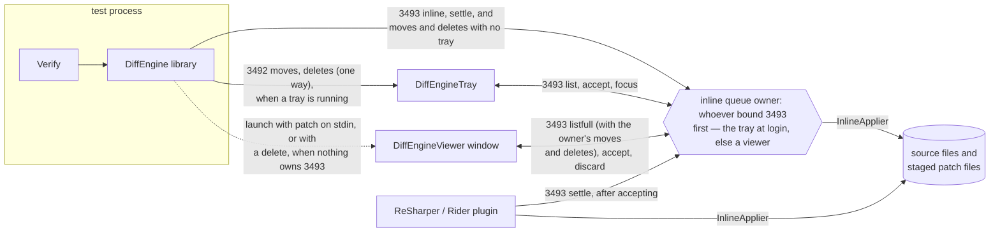
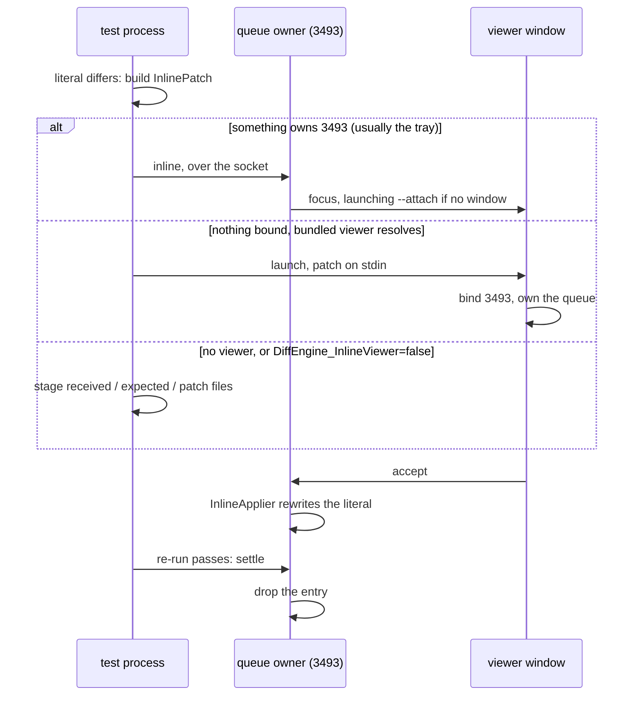

<!--
GENERATED FILE - DO NOT EDIT
This file was generated by [MarkdownSnippets](https://github.com/SimonCropp/MarkdownSnippets).
Source File: /docs/mdsource/inline.source.md
To change this file edit the source file and then run MarkdownSnippets.
-->

# Inline snapshots

The plumbing DiffEngine provides for reviewing
[inline snapshots](https://github.com/VerifyTests/Verify/blob/main/docs/inline-snapshots.md): carrying a pending edit from the test process to a reviewer, showing it, and splicing it into
the source file once accepted. Verify is the producing side; this page documents the DiffEngine
half, for anyone integrating with it — a test library, an IDE plugin, or another review surface.


## The parts

Five parties, three transports: two loopback ports, stdin for a cold launch, and staged files
for when no viewer is available.



The queue of pending snapshots has exactly one owner per session: whichever process bound port
3493 first, decided once and never transferred. When the tray owns it, its edges to the owner
above are in-process calls; when a viewer owns it, the tray drives that viewer over the same
verbs. Either way both hosts run the same `InlineQueue` implementation, so they cannot disagree
on what accepting or settling means. [DiffEngineViewer](/docs/viewer.md) and
[DiffEngineTray](/docs/tray.md) cover the two arrangements in detail.

Pending file moves and deletes follow the same rule. They go to the tray when one is running,
over the port they have always used, and to the queue owner when one is not — so with no tray
installed they are reviewed in the viewer rather than going nowhere. A delete starts a viewer if
nothing owns the queue, because it has no second file to compare against and so no diff tool ever
opens for it. A move does not: DiffEngine has already opened a diff tool for that file pair.


## When a test fails



Nothing touches disk on the happy path: a running owner receives the patch over the socket, a
newly launched viewer receives it on stdin. Staging only happens in the fallback, where the test
library writes three files (Verify: `*.received.txt`, `*.expected.txt`, `*.inlinepatch`) so the
snapshot can still be reviewed by an IDE plugin, a plain text diff tool, or by hand:

```
DiffEngineViewer --inline --source <file.cs> --line <number> < the.inlinepatch
```


## Library API

For the producing side — a test library with a failing inline snapshot:

* `DiffRunner.AddInlineAsync(patch)` queues a patch with whatever owns the port, launching the
  bundled viewer when nothing does. Returns `Queued`, `Disabled` (build servers, continuous
  testing and AI CLIs included), or `NoViewerFound` — the caller's cue to stage files and fall
  back to a text diff.
* `DiffRunner.SettleInline(sourceFile, line)` drops the pending entry for a call site, for when
  a previously failing test passes. Unknown entries and an absent owner are no-ops, so call it
  freely. The settle carries the running framework, so a multi-targeted run only settles its own
  variant of a conflicted entry.
* `AddInlineAsync` stamps `patch.Framework` with the running process's target framework
  ("net9.0", "net48") unless the caller already set it, which is what lets the owner tell a
  re-run from another framework disagreeing. Callers may also set `patch.TestName`, which the
  viewer uses to group and label the queue; without it, items are labeled by call site.
* Setting `DiffEngine_InlineViewer` to `false` reports `NoViewerFound` without probing, which is
  how a user opts into reviewing in their IDE instead of a window.


## The patch file

`InlinePatchFile` reads and writes the wire and staging format for a patch. Plain text, content
fields base64 encoded so snapshot text needs no escaping and no JSON dependency:

```
version: 2
sourceFile: C:\code\project\tests\SampleTests.cs
lineHint: 42
mode: Set
originalExpression: {base64}
newContent: {base64}
testName: {base64}
framework: net9.0
```

`lineHint` is a hint: locating the call is content anchored, so a file that shifted since the
test run still patches, and one whose call site changed reports rather than corrupts. `mode` is
`Set` (replace or insert the expected argument), `Append` (add a Snapshot call where none exists
yet), or `Remove` (delete the call, used when migrating a snapshot back to a file). `testName`
and `framework` are optional provenance — who produced the patch and under which target
framework — parsed tolerantly: absent means unknown, and unknown trailing lines are ignored.


## How the literal is written

`newContent` is the snapshot value, not source text. Turning it into C# is four decisions — which literal form, how long a delimiter, where the argument sits, and how far it is indented — plus the line endings, and every one of them is read off the file being patched rather than configured. `CsStringLiteral.Render` is public, so a surface that wants to produce the identical text can call it instead of reimplementing the rules below.

**Form.** Single line content becomes a regular literal, escaping what that form cannot hold verbatim (`\` `"`, the control characters, `\uXXXX` for the rest). Multi-line content becomes a raw literal. A raw string spends three lines and an indentation rule to carry one line of content, so it is used only where it earns that. Empty content is `""`.

**Delimiter.** Three quotes, or one more than the longest run of quotes in the content — so a snapshot containing `"""` is carried by `""""`.

**Placement.** A raw literal goes on the line below the open paren, so its opening delimiter lines up with its content and its closing one. A regular literal has nothing to line up with and stays in the argument list. An argument that already starts its own line keeps that line.

```csharp
// single line content
await Verify(value).Snapshot("the value");

// multi-line content
await Verify(value).Snapshot(
    """
    line one
    line two
    """);
```

**Indentation.** The call line's own leading whitespace, plus one level. What a level is comes from two places: the character from the call site, so a tab indented method inside a space indented file stays on tabs, and the width from the file, taken as the most common run of whitespace its lines add to the line above. A file that indents by two spaces gets two; four spaces is a fallback for a file with no indentation to read, not a default. Blank lines inside the content are emitted bare, so the literal carries no trailing whitespace.

**Line endings.** The file's dominant ending, with the content normalised to it, so a patch produced on one platform applies cleanly on another. A file that mixes endings keeps every ending it already had: only the spliced span is written, and the rest of the file — encoding, BOM and all — is preserved byte for byte.


## Applying a patch from another surface

The contract for a review surface of its own, which is what the ReSharper / Rider plugin is:
read the staged patch with `InlinePatchFile.TryRead`, apply it with `InlineApplier.Apply`, and
honour two rules.

* **InlineApplier owns all locking.** A per file cross process mutex (up to a ten second wait)
  plus an in process gate serialise every writer, so applying beside a concurrently accepting
  tray or viewer is safe, and callers must not add locking of their own. The file's encoding,
  BOM and line endings are preserved.
* **Settle what was applied.** The same test run that staged the files may also have queued the
  patch with the port owner, and that queue outlives both the window and the run. After
  `Applied` or `AlreadyApplied`, call `DiffRunner.SettleInline(patch.SourceFile,
  patch.LineHint)` — otherwise the tray keeps offering a snapshot that is already in the source.

`Apply` returns `Applied`, `AlreadyApplied` (the literal already matches), `NotFound` (the
source changed since the test run — tell the user to re-run rather than retrying), or a failure
with a message (locked file, unreadable source), which is retryable.

`Remove` mode patches are configuration changes with nothing to review: apply them directly;
`AddInlineAsync` refuses them.


## Ports

| Port | Meaning | Protocol |
| --- | --- | --- |
| 3492 | a tray is here | one way payloads: moves and deletes ([tray](/docs/tray.md#payloads)) |
| 3493 | the inline queue owner is here | request/response verbs, internal |

Two ports because they answer different questions: the owner of 3493 is sometimes a viewer, and
a late starting tray still receives every move on 3492 while it is. `DiffEngine_ViewerPort`
overrides 3493, which test suites use to keep out of the way of a live tray. The 3493 protocol
is internal and versioned; integrate through `DiffRunner` and `InlineApplier` rather than
speaking it directly.
