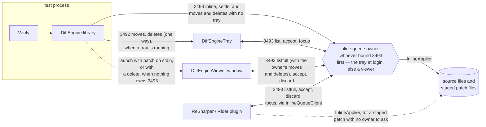
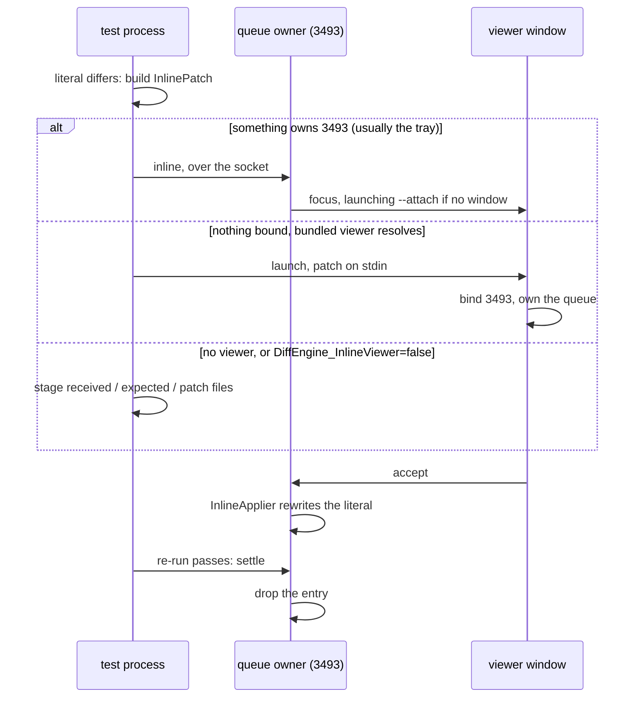

# Inline snapshots

The plumbing DiffEngine provides for reviewing [inline snapshots](https://github.com/VerifyTests/Verify/blob/main/docs/inline-snapshots.md): carrying a pending edit from the test process to a reviewer, showing it, and splicing it into the source file once accepted. Verify is the producing side; this page documents the DiffEngine half, for anyone integrating with it — a test library, an IDE plugin, or another review surface.


## The parts

Five parties, three transports: two loopback ports, stdin for a cold launch, and staged files for when no viewer is available.



The queue of pending snapshots has exactly one owner per session: whichever process bound port 3493 first, decided once and never transferred. When the tray owns it, its edges to the owner above are in-process calls; when a viewer owns it, the tray drives that viewer over the same verbs. Either way both hosts run the same `InlineQueue` implementation, so they cannot disagree on what accepting or settling means. [DiffEngineViewer](/docs/viewer.md) and [DiffEngineTray](/docs/tray.md) cover the two arrangements in detail.

Pending file moves and deletes follow the same rule. They go to the tray when one is running, over the port they have always used, and to the queue owner when one is not — so with no tray installed they are reviewed in the viewer rather than going nowhere. A delete starts a viewer if nothing owns the queue, because it has no second file to compare against and so no diff tool ever opens for it. A move does not: DiffEngine has already opened a diff tool for that file pair.


## When a test fails



Nothing touches disk on the happy path: a running owner receives the patch over the socket, a newly launched viewer receives it on stdin. Staging only happens in the fallback, where the test library writes three files (Verify: `*.received.txt`, `*.expected.txt`, `*.inlinepatch`) so the snapshot can still be reviewed by an IDE plugin, a plain text diff tool, or by hand:

```
DiffEngineViewer --inline --source <source file> --line <number> < the.inlinepatch
```


## Library API

For the producing side — a test library with a failing inline snapshot:

* `DiffRunner.AddInlineAsync(patch)` queues a patch with whatever owns the port, launching the bundled viewer when nothing does. Returns `Queued`, `Disabled` (build servers, continuous testing and AI CLIs included), or `NoViewerFound` — the caller's cue to stage files and fall back to a text diff.
* `DiffRunner.SettleInline(sourceFile, line)` drops the pending entry for a call site, for when a previously failing test passes. Unknown entries and an absent owner are no-ops, so call it freely. The settle carries the running framework, so a multi-targeted run only settles its own variant of a conflicted entry. That framework is the running process's, which makes this the test run's verb and only the test run's: a surface applying a patch of its own wants `SettleAppliedInline`, [below](#applying-a-patch-from-another-surface).
* `AddInlineAsync` stamps `patch.Framework` with the consuming project's target framework ("net9.0", "net48") unless the caller already set it, which is what lets the owner tell a re-run from another framework disagreeing. The value is the `$(TargetFramework)` the package's build targets stamp into the project's runtimeconfig, read back rather than asked of the process — in a hosted test run the entry assembly is the runner (testhost, ReSharperTestRunner), whose framework is not the project's — with the running runtime's version as the fallback for consumers without the targets. Callers may also set `patch.TestName`, which the viewer uses to group and label the queue; without it, items are labeled by call site.
* Set `patch.OriginalExpression` from `CallerArgumentExpression` where the language supplies one, and `patch.OriginalValue` — the previous expected argument's value — where it does not. One of the two is what stops a patch rewriting the wrong call site when the file has moved since the run. `patch.MemberName` from `CallerMemberName` narrows it further, and is supported everywhere including F#.
* Setting `DiffEngine_InlineViewer` to `false` reports `NoViewerFound` without probing, which is how a user opts into reviewing in their IDE instead of a window.


## The patch file

`InlinePatchFile` reads and writes the wire and staging format for a patch. Plain text, content fields base64 encoded so snapshot text needs no escaping and no JSON dependency:

```
version: 2
sourceFile: C:\code\project\tests\SampleTests.cs
lineHint: 42
mode: Set
originalExpression: {base64}
newContent: {base64}
testName: {base64}
framework: net9.0
originalValue: {base64}
memberName: {base64}
```

`lineHint` is a hint: locating the call is content anchored, so a file that shifted since the test run still patches, and one whose call site changed reports rather than corrupts. `mode` is `Set` (replace or insert the expected argument), `Append` (add a Snapshot call where none exists yet), or `Remove` (delete the call, used when migrating a snapshot back to a file). `testName` and `framework` are optional provenance — who produced the patch and under which target framework — parsed tolerantly: absent means unknown, and unknown trailing lines are ignored.

The anchor is `originalExpression`, the source text of the argument the test run saw. A producer whose language does not implement `CallerArgumentExpression` sends `originalValue` instead — the argument's *value* — and the call whose literal parses to it is the one rewritten. Either identifies the call; the expression is used where both arrived, being what the source actually says. With neither, all a patch has is the hint, and a literal that differs is taken as the snapshot that changed rather than as a conflict — otherwise an inline snapshot could be accepted once and never updated.

`memberName` is `CallerMemberName`, and it narrows rather than identifies, since a member holds any number of snapshots. A call above that member's declaration cannot be inside it, so the search will not reach one however well it matches, and the outward walk starts from the declaration rather than from a line that may since have become another test's. What it protects against is two tests in one file with identical snapshots and a hint that has drifted between them; the recorded line is still tried first, which is what keeps two snapshots in the *same* member apart. A member the file no longer declares — a renamed test — is ignored, leaving the hint as it was.

All four of those trailing fields are optional, and everything past the six fixed lines is order agnostic, so they were added without moving the version: a reader that predates one skips the line.


## How the literal is written

`newContent` is the snapshot value, not source text. Turning it into C# is four decisions — which literal form, how long a delimiter, where the argument sits, and how far it is indented — plus the line endings, and every one of them is read off the file being patched rather than configured. `CsStringLiteral.Render` is public, so a surface that wants to produce the identical text can call it instead of reimplementing the rules below.

**Form.** Single line content becomes a regular literal, escaping what that form cannot hold verbatim (`\` `"`, the control characters, `\uXXXX` for the rest). Multi-line content becomes a raw literal. A raw string spends three lines and an indentation rule to carry one line of content, so it is used only where it earns that. Empty content is `""`.

**Delimiter.** Three quotes, or one more than the longest run of quotes in the content — so a snapshot containing `"""` is carried by `""""`.

**Placement.** A raw literal goes on the line below the open paren, so its opening delimiter lines up with its content and its closing one. A regular literal has nothing to line up with and stays in the argument list. An argument that already starts its own line keeps that line.

```csharp
// single line content
await Verify(value).Snapshot("the value");

// multi-line content
await Verify(value).Snapshot(
    """
    line one
    line two
    """);
```

**Indentation.** The call line's own leading whitespace, plus one level. What a level is comes from two places: the character from the call site, so a tab indented method inside a space indented file stays on tabs, and the width from the file, taken as the most common run of whitespace its lines add to the line above. A file that indents by two spaces gets two; four spaces is a fallback for a file with no indentation to read, not a default. Blank lines inside the content are emitted bare, so the literal carries no trailing whitespace.

**Line endings.** The file's dominant ending, with the content normalised to it, so a patch produced on one platform applies cleanly on another. A file that mixes endings keeps every ending it already had: only the spliced span is written, and the rest of the file — encoding, BOM and all — is preserved byte for byte.


## F#

A patch says which file it edits, so nothing has to say which language that file is in: `.fs`, `.fsx` and `.fsi` are patched as F#, everything else as C#. The line ending, indentation and encoding rules above are the same either way, and so is everything else on this page — one applier, one queue, one protocol. `SourceLanguage.ForFile` returns the right one, and `FsStringLiteral` is the public peer of `CsStringLiteral`.

What differs is who takes the layout off. C# has raw strings, so its compiler drops the line break after the opening delimiter and the indentation the closing one sits at, and hands the caller the snapshot. F# has no such form: a triple-quoted literal is verbatim, so what F# hands over still carries that break and the indentation of every line.

So the same shape is written either way, and for F# the trimming is a convention between whoever writes the literal and whoever reads it back. `FsStringLiteral.Render` writes it and `SourceLanguage.SnapshotValue` takes it off - the identity for C#, since its compiler already did. A test library comparing an F# expected argument has to go through that, or every snapshot differs from itself by an indent and never passes.

```fsharp
// single line content
Verifier.Verify(value)
    .Snapshot("the value")
    .ToTask()

// multi-line content
Verifier.Verify(value)
    .Snapshot(
        """
        line one
        line two
        """)
    .ToTask()
```

Content ending in a newline is a blank line before the closing delimiter, exactly as in C#, which is what keeps it distinguishable from content that does not.

The convention is checked by compiling patched source with `dotnet fsi` and applying the trim there, written out in F# rather than called back into DiffEngine - which is what makes it a test of the agreement rather than of one side of it twice.

The alternative, writing content at the left margin so the literal means itself, was tried and abandoned: F# then ends the statement at the closing delimiter, and any snapshot ending in a newline stops the file compiling.

One thing C# can do that F# cannot is widen a delimiter (FS1232), so content containing `"""`, or starting or ending with a quote, has no multi-line form at all and takes a regular literal on one source line. Single line content is always a regular literal, escaping what both languages escape (`\` `"` `\a` `\b` `\f` `\t` `\v` `\n` `\r`) and `\uXXXX` for the rest, since F# has no `\0` or `\e`.

Two syntax differences show up in `Append` and in an argument list. F# does not apply the implicit conversion that lets a `SettingsTask` be awaited, so an F# test ends its chain with `ToTask`; `Snapshot` returns the `SettingsTask`, so an appended call goes in front of that rather than after it. And an argument binds to a parameter with `=`, so an inserted named argument is `expected = "..."`.

```fsharp
// before
Verifier.Verify(value)
    .UseMethodName("customName")
    .ToTask()

// after an Append
Verifier.Verify(value)
    .UseMethodName("customName")
    .Snapshot("the value")
    .ToTask()
```

One difference is not syntax at all. The F# compiler does not implement `CallerArgumentExpression` — it warns FS0202 and leaves the parameter at its default — so an F# patch never carries `originalExpression`. `CallerFilePath` and `CallerLineNumber` work, so the call site is known; what is missing is the anchor that says which call the patch came from when the file has moved under it. An F# producer should send `originalValue` instead, which anchors on what the argument means rather than on what it says, and is what F# does supply — along with `memberName`, since `CallerMemberName` is supported and holds up inside `task` and `async` expressions. Without either anchor, the patch falls back to the line hint alone and rewrites the literal it finds there.

Locating the call is otherwise the same scan, taught F#'s lexis: `(* *)` comments nest, a tick is a char literal only where it cannot be part of a name (`value'`) or a type parameter (`'T`), `(*)` is the multiplication operator rather than a comment, and a name is a declaration only where `let` or `member` says so. A call written without parentheses (`Verifier.Verify value`) is not found — the patch reports rather than corrupts, and the fix is to re-run after adding them.

`FsStringLiteral.Render` takes the call site's indentation, like its C# peer, but means something else by it: not a prefix to write, since the content is verbatim, but the column the result has to clear. A surface rendering its own literal has to pass the indentation of the statement it is splicing into, or it will produce the form that does not compile there.


## Reviewing from another surface

A review surface that is neither the viewer nor the tray — the ReSharper / Rider plugin, or any other tool — reaches the pending snapshots through `InlineQueueClient`, and is then a peer of the tray rather than a fallback for when no viewer could be found. Same queue, same entries, one writer.

* `TryList` returns every pending entry with the patch that produced it, so the snapshot and the text it replaces can be rendered without reading anything from disk. False means no owner answered, which is not the same as an empty queue: a surface that falls back to staged files has to tell those apart. `Find` is that listing narrowed to one call site, keyed by `InlineKey.For(sourceFile, line)`, and `TryListKeys` is the cheap half — which call sites are pending, for deciding whether to offer an action without the payload of every patch crossing the wire.
* `Accept` asks the owner to apply the patch and drop the entry. Applying happens there rather than here, which is what keeps one writer per source file and leaves every display agreeing about what is still pending — and why there is no local apply to settle afterwards.
* `Discard` drops an entry without applying it. `Focus` hands one to the viewer window instead of accepting it, starting a window when the owner has none.

`Accept` returns `Accepted` (the entry has gone), `Failed` (still pending and retryable — a locked file, or a conflicted entry that has to be resolved in the viewer), or `Unknown` (nobody owns the queue, or it holds nothing for that call site). It hands back the owner's own message, which is what tells an applied patch from a stale one that was dropped: the wire carries whether the verb was carried out rather than an apply status, so from a client those are the same observation, and only the words separate them.

Listing waits half a second, since an owner that cannot answer one in that time is wedged rather than slow, and a refused connection is immediate either way. Accepting waits fifteen seconds, because the owner applies through `InlineApplier` and that can sit on its cross process mutex for ten.


## Applying a patch from another surface

For the staging fallback, where no viewer could be resolved and the patch is a file on disk rather than an entry in a queue: read it with `InlinePatchFile.TryRead`, apply it with `InlineApplier.Apply`, and honour two rules.

* **InlineApplier owns all locking.** A per file cross process mutex (up to a ten second wait) plus an in process gate serialise every writer, so applying beside a concurrently accepting tray or viewer is safe, and callers must not add locking of their own. The file's encoding, BOM and line endings are preserved, and its extension picks the language.
* **Settle what was applied.** The same test run that staged the files may also have queued the patch with the port owner, and that queue outlives both the window and the run. After `Applied` or `AlreadyApplied`, call `DiffRunner.SettleAppliedInline(patch)` — otherwise the tray keeps offering a snapshot that is already in the source. Not `SettleInline`: that one labels the settle with the running process's framework, which here is the applier's rather than the test project's, so the owner finds no variant to strip and does nothing — and answers no differently than if it had, so the miss is silent. `SettleAppliedInline` carries no framework at all, which is the right statement to make: replacing the literal the source held leaves every framework's variant anchored to text that has gone, so none of them can apply any more. It also takes the whole patch, so `MemberName` goes along and the entry is still found once an earlier accept has pushed its line down the file.

`Apply` returns `Applied`, `AlreadyApplied` (the literal already matches), `NotFound` (the source changed since the test run — tell the user to re-run rather than retrying), or a failure with a message (locked file, unreadable source), which is retryable.

`Remove` mode patches are configuration changes with nothing to review: apply them directly; `AddInlineAsync` refuses them.


## Ports

| Port | Meaning | Protocol |
| --- | --- | --- |
| 3492 | a tray is here | one way payloads: moves and deletes ([tray](/docs/tray.md#payloads)) |
| 3493 | the inline queue owner is here | request/response verbs, internal |

Two ports because they answer different questions: the owner of 3493 is sometimes a viewer, and a late starting tray still receives every move on 3492 while it is. `DiffEngine_ViewerPort` overrides 3493, which test suites use to keep out of the way of a live tray. The 3493 protocol itself is internal and versioned; integrate through `DiffRunner` to produce, `InlineQueueClient` to review, and `InlineApplier` to write, rather than speaking it directly.
