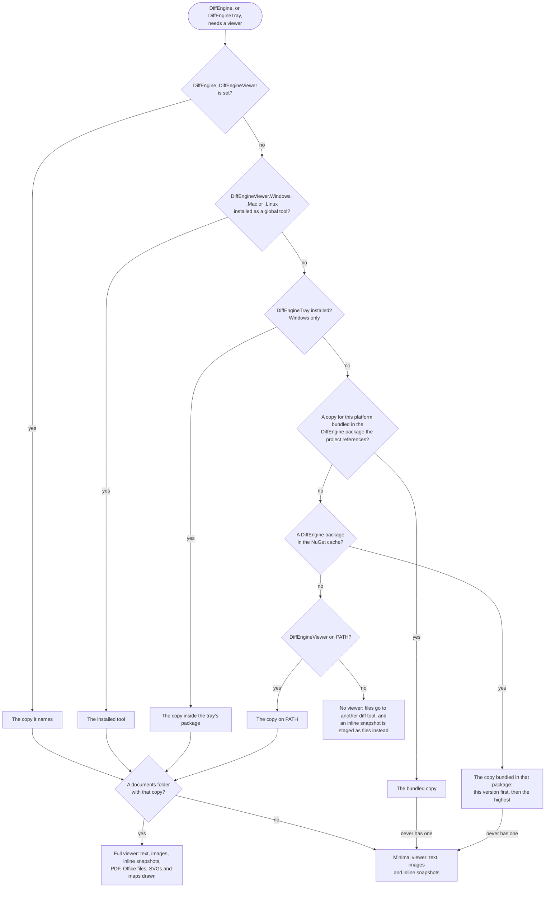

<!--
GENERATED FILE - DO NOT EDIT
This file was generated by [MarkdownSnippets](https://github.com/SimonCropp/MarkdownSnippets).
Source File: /docs/mdsource/viewer.source.md
To change this file edit the source file and then run MarkdownSnippets.
-->

# DiffEngineViewer

DiffEngineViewer is a cross platform diff tool for text files, images and inline snapshots. It is the reviewer for [inline snapshots](https://github.com/VerifyTests/Verify/blob/main/docs/inline-snapshots.md): it shows the received text against the expected text, and accepting rewrites the literal in the source file.

Unlike every other entry in the [tool list](/docs/diff-tool.md), it does not need to be installed. A copy ships inside the DiffEngine package, so it is always present.

The renderer is native to each platform:

| Platform | Renderer |
| --- | --- |
| Windows | WinForms |
| macOS | AppKit and Core Text |
| Linux | [Dear ImGui](https://github.com/ocornut/imgui) through [raylib](https://github.com/raysan5/raylib) |

All three draw the same screen model, and the layout, scrolling and keyboard handling are shared, so the only difference is how the pixels get there.


## NuGet

 * https://www.nuget.org/packages/DiffEngineViewer.Windows
 * https://www.nuget.org/packages/DiffEngineViewer.Mac
 * https://www.nuget.org/packages/DiffEngineViewer.Linux

Only needed to use the viewer outside a project that references DiffEngine, since DiffEngine already bundles it, or to read [documents](#documents), which only these packages and the copy installed with [DiffEngineTray](/docs/tray.md) do.

```
dotnet tool install -g DiffEngineViewer.Windows
```

One package per operating system rather than one for all of them, because WinForms has to be named as a framework dependency and a package that names it cannot start anywhere else. The copy bundled in DiffEngine is unaffected: it is published per RID and resolved by directory.


## Which copy runs

The viewer comes in two variants. The **full** one carries a `documents` folder and does everything on this page. The **minimal** one is the same viewer without that folder: it reviews text, [images](#images) and inline snapshots, leaves a PDF or an Office file to another diff tool, and reads an SVG or a GeoJSON file as text.

Which one runs is not a setting. DiffEngine, and [DiffEngineTray](/docs/tray.md) when it opens a window, take the first copy found, and that copy either has the folder with it or does not:



An installed tool comes first because installing one is an explicit choice of which viewer to run. The bundled copy comes ahead of the NuGet cache because it is the version the library about to launch it was built with; the cache is searched as well because not every project shape tells the library where its package is.

There is one exception to the first copy found. A copy from before 20.5.0 is passed over when a newer one is further down that list, and taken only when it is the only one there is. A viewer that old exits on the `--payload` file a failing inline snapshot is launched with, so an installed tool or tray that had not been updated lost the snapshot. A copy named by `DiffEngine_DiffEngineViewer` is used as named, whatever its version.

A viewer that is started and exits with a failure before it holds the queue is reported as not started, so an inline snapshot is staged as files rather than said to be queued.

The folder is looked for beside the copy that was found rather than assumed from where it came from, so a tool installed before documents existed is a minimal viewer, and is not offered files it would show as text. Setting `DiffEngine_DiffEngineViewer` to a path with no viewer at it is an error rather than a fall through to the next copy.

So the full viewer is one install away, with nothing to configure afterwards:

```
dotnet tool install -g DiffEngineViewer.Windows
```

or, on Windows, [DiffEngineTray](/docs/tray.md), which carries one.


### Why the bundled copy is minimal

DiffEngine is a library. It is referenced by Verify, ApprovalTests and Shouldly, so every test project using one of them restores it: on every developer machine, and on a build agent with a clean cache, on every run. A build agent is also where the viewer never opens, since DiffEngine is [disabled](/docs/#disabled) on build servers. Whatever is bundled is paid for most often exactly where it is never used.

It is also one package for every platform, where each standalone tool is one operating system's. A NuGet package is restored whole, so anything bundled is bundled six times, once per RID.

Measured on version 20.6.0:

| | Download | On disk |
| --- | --- | --- |
| DiffEngine as it ships, with six minimal viewers | 7 MB | 18 MB |
| The six minimal viewers within that | 5 MB | 10 MB |
| The `documents` folder for all six platforms | 58 MB | 133 MB |
| DiffEngine if it bundled the full viewer | 66 MB | 151 MB |

The `documents` folder is PDFium, Skia, [Morph](https://github.com/Papyrine/Morph), [GeoConvert](https://github.com/Papyrine/GeoConvert) and the Open XML SDK: about 16 MB of managed libraries, which the platforms could share, and around 20 MB of natives for each of them, which they cannot. A minimal viewer is 1 MB on Windows and macOS and 3 MB on Linux, where it carries its own renderer. Bundling the full viewer would make every restore of every test project nine times the download, to draw formats most snapshots are not.

Bundling nothing is not the answer either, because of inline snapshots. Every other tool in the [tool list](/docs/diff-tool.md) compares two files, and an inline snapshot has no second file: the expected text is a literal in the source, and accepting means rewriting that literal. The viewer is the only diff tool that can do that. Without a copy in the package, someone with neither the tool nor the tray installed would have a failing inline snapshot and no diff tool able to accept it.

So the package carries the least that keeps inline snapshots working with no install, and the documents are opt in. That split costs little: the formats the minimal viewer leaves out are the ones other tools already open, and DiffEngine goes on to offer Word, Excel, Beyond Compare or whatever else is installed for them.


## Usage

Comparing two files, in a window of its own:

```
DiffEngineViewer <left> <right>
```

Comparing a failing pair, which DiffEngine sends when the diff tool it resolved for that pair is the viewer. Queued rather than given its own window, so later pairs join it:

```
DiffEngineViewer --diff <received> <target>
```

Reviewing an inline snapshot, where the patch payload arrives in a file the viewer deletes once read, or on stdin when no file is given:

```
DiffEngineViewer --inline --source <source file> --line <number> [--payload <file>]
```

Reviewing a file a passing test no longer produces, which DiffEngine sends when no tray is running:

```
DiffEngineViewer --delete <file>
```

Displaying a queue held by another process, which is how [DiffEngineTray](/docs/tray.md) opens one:

```
DiffEngineViewer --attach
```

Nothing is staged for inline review. A newly launched viewer gets the patch in a temp file, which it deletes once read, and one already holding the queue gets it over a loopback socket.


## Keys

| Key | Action |
| --- | --- |
| `Up` `Down` `PgUp` `PgDn` `Home` `End` | Scroll |
| `n` `p` | Next and previous change (also the **Next change** and **Prev change** buttons) |
| `m` | Show only the changes, or every line (also the **Changes only** button) |
| `r` | Cycle a [document](#documents) between text and picture, picture only, and text only (also the button naming the next view) |
| `[` `]` | Previous and next page of a document (also **Prev page** and **Next page**) |
| `j` | Draw a [map](#maps) in the next projection (also the **Projection** button) |
| `+` `-` `0` | [Zoom](#zooming) a picture in, out, and back to fitted (also **Zoom in** and **Zoom out**, and the wheel over a picture) |
| `Tab` `Shift+Tab` | Next and previous pending item |
| `a` | Accept |
| `Shift+A` | Accept all |
| `d` | Discard |
| `v` | Cycle the variants of a conflicted snapshot (also the Variant button) |
| `Ctrl+A` | Select all of one pane |
| `Ctrl+C` | Copy the selection (`Ctrl+Insert` as well, on Windows) |
| `q` `Esc` | Close |


## Moving between changes

A comparison opens scrolled to its first change, with three lines of context above it, rather than at line 1. **Next change** and **Prev change** move from one change to the next, putting each in the same place under the top of the pane, and each is disabled when no change is left in its direction.

**Changes only** switches to a minimal view: each change with the three lines either side of it, and every longer run of unchanged lines folded into one row saying how many lines it stands for. The button then reads **All lines**, which switches back. Switching keeps the line being read where it is on screen, and the choice holds while moving through the queue. Images are never folded, because their rows are their properties and each is worth reading.

A fold is only a view. A selection that spans one copies the lines it stands for, since those are what lies between the selection's two ends, and the status line names the stretch of the file on screen rather than a count of rows: sixteen rows in the minimal view can read `lines 1-30 of 40`.


## Selecting and copying

Drag across either pane to select text, and `Ctrl+C` to copy it. `Ctrl+A` selects one whole pane: the one something is already selected in, or the received side when nothing is. On macOS the Edit menu carries both, so `Cmd+C` and `Cmd+A` work there too.

A selection belongs to one pane. Dragging out of it keeps extending within the side the drag started in rather than crossing into the other, because the two sides are different documents. It survives scrolling, so a range taller than the window is a drag plus a wheel. The status line says how much is selected, and a click with no drag behind it clears it.

Right-clicking a pane offers the same without the keys: **Copy selection** when there is one, **Copy all** for the whole of that side, and **Select all** for that pane. It leaves the selection as it is, since copying what has been dragged across is the usual reason to open it, and a pane with nothing in it has no menu.

What lands on the clipboard is what is on screen: tabs already expanded to the four spaces the panes draw them as, and no line numbers or change markers. Filler rows are left out — the blank lines that keep the two panes aligned where one side has no line are padding rather than content, so pasting a selection back gives the file's lines and nothing else.


## Multiple pending snapshots

A test run that fails several inline snapshots produces one window, not several. Whichever process binds the loopback port holds the queue; everything else hands its patch to that one. The window lists everything pending and offers **Accept all**.

**Accept all** takes as long as the queue is long, so it goes a step at a time. Each entry leaves the list as it lands, the status line says how far it has got (`Accepting 12 of 40`), and the window keeps responding throughout. The snapshots of one source file are a single step: they are written into the file together, with one read and one write, and leave the list together. **Accept**, **Discard** and **Accept all** are disabled until it finishes; scrolling, selecting and copying are not. **Accept all in ...** on a header goes the same way, over that header's entries. It is the same when [DiffEngineTray](/docs/tray.md) holds the queue, and when the accept-all was started from the tray's menu: the window follows the tray's progress.

Failing file comparisons join the same queue, so a run that fails ten snapshots opens one window whether they are inline or on disk. Every other diff tool gets a process per pair, and DiffEngine closes each one as its test starts passing; the viewer is told to drop that row instead.

Rows that came from files follow those files. A re-run that rewrites a received file shows the rewrite, a verified file that appears fills in the other pane, and a row whose received file goes away leaves with it — so nothing is offered for a file that is no longer there, however it went. The window closes once the last row does.

The list sits in a column on the left. Drag the divider beside it to widen the column when the file names are longer than it is. When the list outgrows the window it follows the selection, keeping the selected row visible.

Row labels are the shortest thing that tells one entry from another, so hovering one fills in what it left out: the whole path, the test behind a call site, every framework behind a conflict, and the failure behind a `!`. A row with nothing to add shows no tooltip at all.

The panes carry a scrollbar, which moves with the keys and the wheel.

Closing the window discards the queue, unless [DiffEngineTray](/docs/tray.md) is running, in which case the tray still has it and can reopen a window on it.


## Context menus

Every row of the pending column answers a right-click:

 * An inline snapshot offers **Accept**, **Discard** and **Open source file**, plus **Show next variant** when frameworks disagree about it.
 * A move offers **Accept move**, **Discard** and **Open target directory**; a delete offers **Accept delete**, **Discard** and **Open directory**.
 * A solution header offers **Accept all in ...** and **Discard all in ...** for that solution only, and a test sub-header the same for that test's changes. Bulk accepts skip conflicted snapshots, the way accept-all does.
 * Every entry also offers **Copy selection** when there is one, and a **Copy** item per pane, named after that pane, which copies the whole side. A side with nothing in it — the expected side of a brand new snapshot, or what is left after a delete — gets no item rather than one that copies nothing.

Right-clicking an entry selects it first, so the menu acts on what is highlighted. Opening a file manager is always local — the files are on this machine, wherever the queue lives.

The panes answer one too, with only the [copying](#selecting-and-copying): nothing in it accepts or discards, so a click meant to copy cannot land on either.

On Windows and macOS this is the real OS menu, so it also takes the arrow keys, Enter, Escape and type-to-select, flips rather than clips near the edge of a screen, and is readable by a screen reader. A click that dismisses it is consumed doing so, which is why right-clicking a different row while a menu is open takes two clicks. On Linux it is drawn by the viewer, and any other click or key closes it.

macOS also carries a menu bar: a Snapshot menu listing the same commands as the keys above, and an Edit menu with Copy and Select All. Those two are the only items carrying a key equivalent, because the rest are plain letters and a menu would match them before the window ever saw them.


## Grouping

When the pending items span more than one solution, the list groups them under solution headers with counts. The solution is found by walking up from each source file; items with no discoverable solution trail at the end, ungrouped. A queue from one solution stays flat.

When one test produced more than one change, those changes gather under a sub-header carrying the test name. Test names come from the caller (Verify) and are optional; without them, items are labeled by call site. Two items that would read identically — the same file name and line in two projects — grow the shortest distinguishing directory prefix.

Every header carries a marker: `-` when open, `+` when folded. Clicking a header folds its group, and the header's right-click menu offers the same. A fold is only a view — what it hides is still pending, still counted by the header hiding it, and still taken by **Accept all**. `Tab` steps over folded items rather than into them, and anything that selects an item from outside the window unfolds whatever was hiding it.


## Conflicting snapshots

A test run under several target frameworks can produce different content for the same call site. The queue keeps each distinct content as a labeled variant of one entry — `net8.0`, `net9.0` — rather than letting the last writer win. Identical content from several frameworks merges into one variant carrying all their labels.

A conflicted entry is marked `*` in the list, the pane header names the framework on screen (`received (net8.0)`), and a **Variant** button (or `v`) cycles through the disagreeing contents. Accepting applies exactly the variant on screen and resolves the whole call site; a framework that still disagrees will re-report on its next run. **Accept all** never picks sides: it skips conflicted entries and says how many still need review. A framework whose test starts passing settles only its own variant, so the other framework's still-failing content stays reviewable.


## Moves and deletes

When [DiffEngineTray](/docs/tray.md) owns the queue, the viewer also lists the tray's pending file moves and deletes beside the snapshots, grouped by solution like everything else. A move shows the received file against the committed one; a delete shows the file's content against nothing. The files are read locally — the protocol never leaves the machine — and accept and discard are forwarded to the tray, which is why the buttons name the act: **Accept move**, **Accept delete**.

**Accept all** on a tray-owned queue sweeps everything the window shows: deletes, moves and snapshots, with conflicted snapshots skipped and anything locked kept pending and counted. The deletes are the ones pending when it began, and are held back when a snapshot was not written. One for a file that a move in the same sweep has written is left pending.

A viewer that owns the queue itself never shows moves or deletes, because DiffEngine only sends them to a running tray.


## Images

`.png`, `.jpg`, `.jpeg`, `.gif`, `.bmp`, `.webp` and `.ico` are compared as pictures rather than as text, wherever they turn up: a pair passed on the command line, or a move or delete the tray is holding.

Each pane lists what its own side is — format, pixel dimensions and byte count — with a property that matches the other side reading as unchanged and one that does not reading as modified, the same colouring a line of text gets. Whether the two are the same picture belongs to the pair rather than to either side, so it is stated in the status line: **images are identical**, **images differ**, or **only \<file\> exists** when one side has nothing yet, which is the normal state of a brand new image snapshot.

The extension decides, not the content. A `.png` holding something that is not one is still an image side, and says its format was not recognized instead of rendering the bytes as text.

Each pane also draws the picture itself, one blank line under those rows: fitted to the space, never enlarged past its own size unless [zoomed](#zooming), on a checkerboard so transparency reads as transparent. All three heads place it identically, from the size the file's own header gave rather than from whatever their decoder reported. Pictures are decoded and scaled off the window's thread, so a large one never stops the window responding, and a spinner turns where it will appear until it is ready. Only the pictures of the entry on screen are decoded.

Which formats can be drawn is the platform's answer rather than the viewer's, because each head uses the decoder its toolkit ships with:

| Head | Drawn |
| --- | --- |
| Windows (GDI+) | `.png` `.jpg` `.jpeg` `.gif` `.bmp` `.ico` |
| macOS (ImageIO) | all seven |
| Linux (raylib) | `.png` `.jpg` `.jpeg` `.gif` `.bmp` |

A format a head cannot decode draws nothing, and the comparison is still there in the rows above it. That is why those rows are the description and the picture is an addition to it.

Accepting is the same act it is for text — copy the received file over the expected one, or forward the move to the tray — so nothing about reviewing an image changes what accepting one does.


### Zooming

Any picture can be enlarged: an image, a document's page, an SVG or a map. `+` and `-`, **Zoom in** and **Zoom out**, or the wheel while the pointer is over the picture, move it a step at a time through 150%, 200%, 300% and on to sixteen times the size that fits. `0` goes back to fitted. With `Ctrl` held the wheel zooms wherever the pointer is; without it, the wheel over the rows still scrolls them. On macOS a pinch zooms as well.

Both panes are always enlarged by the same amount about the same point, so they show the same part of each picture. Once a picture is larger than the space under its rows it is cut off at the edges of that space, and dragging it moves both sides together. Past its own size a picture is drawn as the pixels it has rather than smoothed, since a one pixel difference between two snapshots is what zooming that far in is for.

The status line says how far in the view is, `images differ, zoom 400%`, which is also what tells a reader looking at one corner of a page that a corner is what they have. Turning a document's page keeps the zoom and the place; moving to another entry starts fitted again.


## Documents

The standalone tool and the copy installed with [DiffEngineTray](/docs/tray.md) carry a `documents` folder, and with it read `.pdf`, `.docx`, `.xlsx` and `.pptx` files, and draw `.svg` files and [maps](#maps). The copy bundled in the DiffEngine package does not, [to stay small](#why-the-bundled-copy-is-minimal): the folder is about 16 MB of libraries and 20 MB of natives per platform. That copy reads these files exactly as it always has, an SVG or a GeoJSON file as text.

A document is shown one of three ways, and `r`, or the button naming the next one, cycles between them:

| View | Shows |
| --- | --- |
| Text and picture | The text in the top half of each pane, and the page being read drawn under it. The default. |
| Picture only | The page, under two rows saying what each file is. |
| Text only | The text, as any text file is shown. |

The view is chosen per type of document and [remembered](#what-is-remembered): a spreadsheet read as its text and a map looked at as its picture each open the way they were last looked at, in the same queue and in the next run.

What the text is depends on the format:

 * SVG, and a map that is text: the file itself.
 * A binary map: its features as GeoJSON.
 * PDF: each page's text under a `--- page N ---` line, read with [PDFium](https://pdfium.googlesource.com/pdfium) through [Morph.PDFium](https://github.com/Papyrine/Morph.PDFium).
 * Word, Excel and PowerPoint: the document as Markdown, from [Morph](https://github.com/Papyrine/Morph). Embedded pictures become `image-N` references rather than lines of base64.

Pages are drawn by PDFium for a PDF, by Morph for an Office file and by [Svg.Skia](https://github.com/wieslawsoltes/Svg.Skia) for an SVG. A spreadsheet's pages are its printed pages rather than its sheets. Drawing is deterministic, so the same page always draws to the same bytes, which is how the viewer knows which pages differ. A small SVG is drawn at a reviewable size rather than its own, since a picture is not enlarged on screen until it is zoomed.

A document opens at its first page that differs, the way a text comparison opens at its first change. `[` and `]`, or **Prev page** and **Next page**, turn the page on both sides at once. With only the pictures on screen, **Prev change** and **Next change** move between the pages that differ.

The status line says what is known about the pair as it becomes known: `reading text` and `drawing` while that happens, which page is showing and which differ, `every page draws the same` when the files differ only where nothing shows, and `documents are identical` when the bytes match. Each pane's header names the page it shows, `received.pdf (page 2 of 5)`, or `(no page 6)` when that side has fewer.

Reading and drawing happen on a thread of their own once the window is up, so a long document never holds a test run waiting on the viewer, and never holds the window either. Only the entry on screen is read and drawn: with several documents pending, the rest wait until they are opened, rather than keeping the thread busy with documents that may never be looked at. While a page is still being drawn, a spinner turns where it will appear. The two sides of a pair are drawn at the same time, so the pages of the right appear beside the pages of the left, and which pages differ is known as they are drawn rather than once both are done. Each document is read from a copy the viewer takes, never the file itself, so it cannot hold a lock that stops it being accepted. They run inside the viewer's process: each side is given up on once two minutes pass with nothing coming of it, neither its text nor another page, and a PDF opened while that one is still being read, the other side of its own pair included, waits for it rather than failing. A copy that could not be taken, because the disk was full or something held the file, is said in the status line and tried again. One that crashes PDFium or Skia takes the window with it, and with no tray running, any inline snapshots the window was holding.

A file that is not the document its extension says is ordinary — a test that failed part way through writing its snapshot, an empty file, an error page saved as a PDF — and is reported rather than drawn. The status line says so once, about the file: `could not read report.received.docx: Not a readable Word document: it is not a zip archive, or was cut short`, or `The file is empty`. Its pane shows what the file is and how large instead of text, its header says `(not drawn)`, and the other side, if it is whole, is still read and drawn. Nothing about it carries over to the next document.

An SVG is drawn with scripts, external images and external elements turned off. A snapshot is test output, and nothing in one gets to reach the network or the disk.

DiffEngine offers the viewer for `.pdf`, `.docx`, `.xlsx`, `.pptx` and the map extensions only when the copy it resolved carries the folder. The viewer is last in the default tool order, so Word, Excel, Beyond Compare or DeltaWalker are still preferred where installed.


### Maps

Maps are read and drawn with [GeoConvert](https://github.com/Papyrine/GeoConvert). Each is one picture, as an SVG is, so there are no pages to turn, and the status line says whether the two draw the same.

| Format | Extension | Text |
| --- | --- | --- |
| GeoJSON | `.geojson` | The file |
| TopoJSON | `.topojson` | The file |
| KML | `.kml` | The file |
| GPX | `.gpx` | The file |
| WKT | `.wkt` | The file |
| KMZ | `.kmz` | GeoJSON |
| WKB | `.wkb` | GeoJSON |
| FlatGeobuf | `.fgb` | GeoJSON |
| GeoParquet | `.geoparquet` | GeoJSON |

A map is drawn with its longer side 2048 pixels, in the projection GeoConvert picks for its extent. A map with no features is reported as having nothing to draw. Shapefiles are left out, being a set of files where a snapshot is one, and so are `.json`, `.csv` and `.parquet`, which hold far more than maps.

`j`, or the **Projection** button, draws both sides in the next projection, and the button names the one on screen:

| Projection | Is |
| --- | --- |
| Auto | Chosen from what the map covers: a conic for a region, equirectangular for a continent, an equal area one for the world. The default. |
| Equirectangular | Longitude and latitude as x and y. |
| Web Mercator | The layout of web map tiles. |
| Lambert conic | Conformal, for a region. |
| Goode homolosine | Equal area and interrupted, for the world. |

Going round to one already drawn shows it at once, and the one left on is [remembered](#what-is-remembered): the next map, in this run or the next, opens in it.


## What is remembered

The viewer keeps a few things from one run to the next, in `viewer.settings` beside the tray's settings: `%LOCALAPPDATA%\DiffEngine` on Windows, `~/.local/share/DiffEngine` on Linux and `~/Library/Application Support/DiffEngine` on macOS.

 * Where the window was, how large, and whether it was maximised. A window left maximised opens maximised, and restoring it goes back to the size it had before. One remembered on a display that is no longer there opens on one that is.
 * How each type of [document](#documents) was last shown: text and picture, picture only, or text only.
 * The [projection](#maps) maps were last drawn in.

The file is a `key=value` line each, and deleting it, or a line of it, is how to forget. One that cannot be read or written costs the setting and nothing else.


## With DiffEngineTray

The tray starts at login, so it normally binds the port first and holds the queue. The viewer then displays it: it reads the pending snapshots back over the socket and forwards accept and discard rather than applying them. That is what `--attach` is for, and the tray starts one whenever a snapshot arrives with no window open.

The point of that arrangement is that the queue outlives the window. A viewer that is closed, killed or crashes takes nothing with it, and there is no 52 MB process kept resident purely to hold a list.

If a viewer was already running when the tray started, the viewer keeps the queue for as long as it lives and the tray drives it remotely instead. Ownership is decided once and never moves. Either way both surfaces run the same queue implementation, so they cannot disagree on what accepting or settling means, and the tray's **Pending Snapshots** group can accept, discard, open the viewer on a particular snapshot, and close the viewer.

Exiting the queue's owner — closing an owning viewer with no tray running, or exiting the tray — writes any still-pending inline snapshots back to disk, under the source project's `obj/VerifyInline/`, where accept tooling such as [Verify.Terminal](https://github.com/VerifyTests/Verify.Terminal) still finds them. A kill or a crash skips that, and loses the queue as it loses pending file moves and deletes; re-run the tests.


## With no tray

Pending file moves and deletes go to the tray when one is running. When one is not, they go to the viewer, which holds and applies them itself — so a received file waiting to be promoted, or a verified file a passing test no longer produces, is reviewable rather than invisible.

A pending delete starts a viewer if none is running. It is the one change with no second file to compare against, so no diff tool ever opens for it, and a window is the only surface it can have. A pending move does not start one: DiffEngine has already opened a diff tool for that file pair, and a second window competing with it is not an improvement. A move joins a window that is already open.

Both look and behave exactly as they do when the tray owns them — same rows, same context menu, same **Accept all** — because which process is holding a pending file depends only on whether a tray happened to be running.


## Disabling

Set `DiffEngine_InlineViewer` to `false` to stop inline snapshots opening a window. The viewer also never launches when [DiffEngine is disabled](/docs/#disabled), which covers build servers, continuous testing and AI CLIs.


## Platforms

Ships for `win-x64`, `win-arm64`, `linux-x64`, `linux-arm64`, `osx-x64` and `osx-arm64`.

[Which copy runs](#which-copy-runs) on each is resolved the same way. With no copy found, resolution falls through to whatever other diff tool is available.
